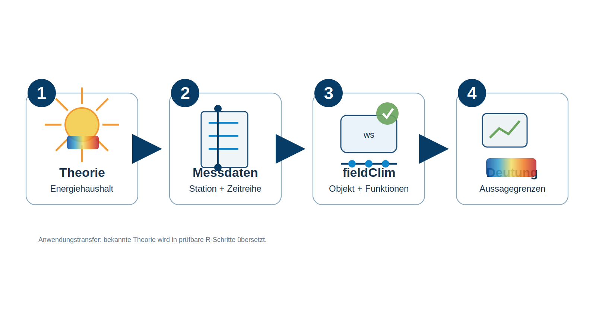

:::{.reader-lead}
Dieser Kurs übersetzt die bereits behandelten Grundlagen von Gelände- und Mikroklima in eine reproduzierbare Arbeit mit Messdaten. Im Mittelpunkt steht nicht noch einmal die Theorie des Energiehaushalts, sondern die Frage, wie eine reale Station in R gelesen, geprüft, strukturiert und mit `fieldClim` ausgewertet wird.
:::

Geländeklima entsteht dort, wo großräumige Wetterbedingungen auf konkrete Oberflächen treffen. Relief, Bewuchs, Bodenfeuchte, Rauigkeit, Strahlung und Wind bestimmen, wie viel Energie an einer Stelle verfügbar ist und wie sie zwischen Boden, Luft und Verdunstung aufgeteilt wird. Diese Zusammenhänge sind aus der Theorie bekannt. In der Anwendung werden sie aber nicht automatisch sichtbar. Sie müssen aus Messspalten, Zeitstempeln, Sensorhöhen und methodischen Annahmen rekonstruiert werden.

`fieldClim` ist in diesem Kurs deshalb kein Zusatzwerkzeug, sondern der zentrale Übersetzungsschritt. Das Paket bündelt wiederkehrende Arbeiten, die bei geländeklimatischen Stationsdaten immer wieder auftreten: Zeitreihen prüfen, Strahlung und Bodenwärmestrom kontrollieren, Messhöhen und Standortinformationen ordnen, ein `weather_station`-Objekt aufbauen und Wärmeflussmethoden methodisch begründet anwenden.

{fig-align="center" width="95%"}

Die Abbildung fasst die Grundbewegung des Kurses zusammen. Theorie bleibt der fachliche Hintergrund, aber der eigentliche Arbeitsgang beginnt mit Messdaten. Aus ihnen entsteht eine strukturierte Station. Erst danach werden Funktionen und Methoden eingesetzt. Die Auswertung endet nicht bei einer Zahl oder einem Plot, sondern bei einer begründeten Aussage darüber, was aus dem vorhandenen Messaufbau wirklich geschlossen werden darf.

## Arbeitsverständnis

Die Kursseiten sind als Reader angelegt. Sie sollen nicht möglichst viele Funktionen dokumentieren, sondern den Weg von der Messdatei zur fachlichen Entscheidung transparent machen. Der Code bleibt deshalb absichtlich schlicht. Wir verwenden relative Projektpfade, `here::here()`, einfache Tabellenoperationen, direkte Spaltenzugriffe und base-R-Grafiken. Ziel ist nicht ein besonders eleganter R-Stil, sondern ein Arbeitsablauf, den man fachlich versteht, wiederholen und auf eigene Stationsdaten übertragen kann.

Die wichtigste Kompetenz besteht darin, Daten nicht zu früh als „fertig“ zu behandeln. Eine Stationsdatei ist zunächst nur eine technische Aufzeichnung. Erst wenn Zeitachse, Einheiten, Lücken, Sensorrollen und Standortannahmen geprüft sind, kann sie als Grundlage für Energiehaushalts- und Wärmeflussdiagnosen dienen.

## Aufbau der ersten Einheit

Die erste Kurseinheit beginnt bei der Datenbasis. Sie zeigt, wie aus einer Stationsdatei ein kontrollierter Arbeitsdatensatz entsteht und wie daraus ein `weather_station`-Objekt aufgebaut wird. Dieses Objekt ist die Brücke zwischen Messung und Paketlogik: Es ordnet Spalten in fachliche Rollen ein und sorgt dafür, dass spätere Funktionen dieselbe Station mit denselben Annahmen verwenden.

Der Kurs folgt damit einer einfachen, aber strengen Reihenfolge: erst Daten lesen, dann Daten prüfen, dann in eine fachliche Struktur überführen, dann Methoden anwenden und erst am Ende interpretieren.
