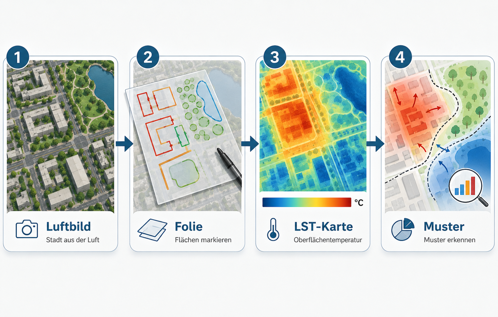
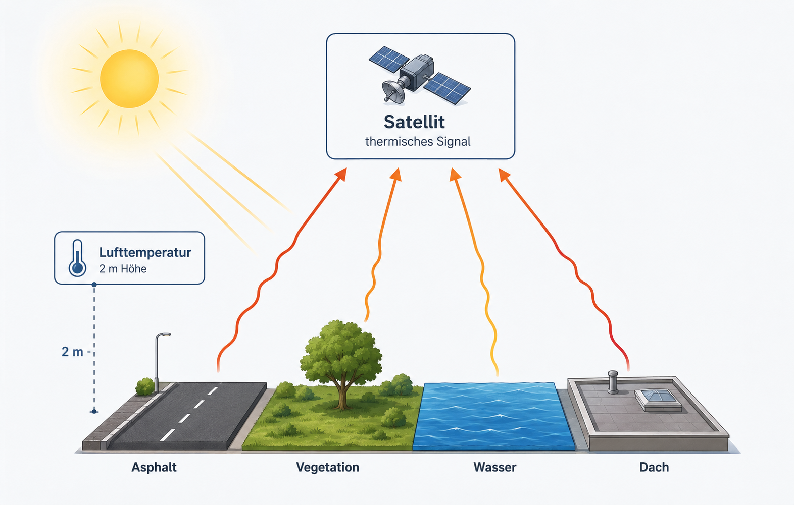
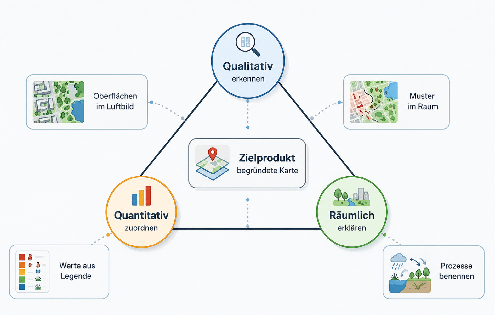
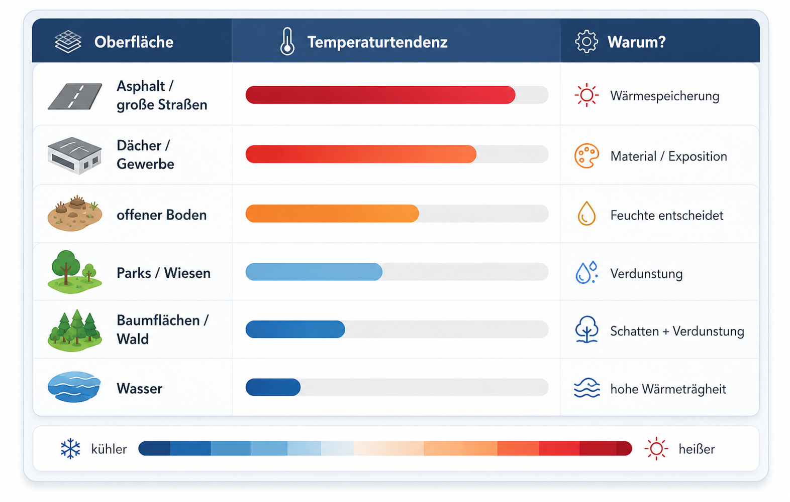
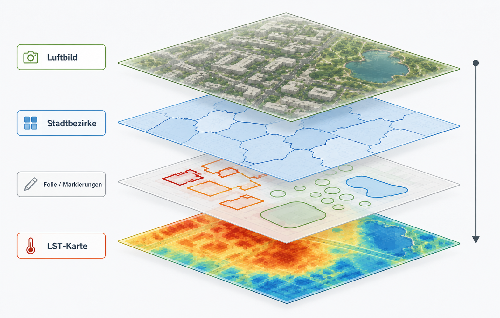
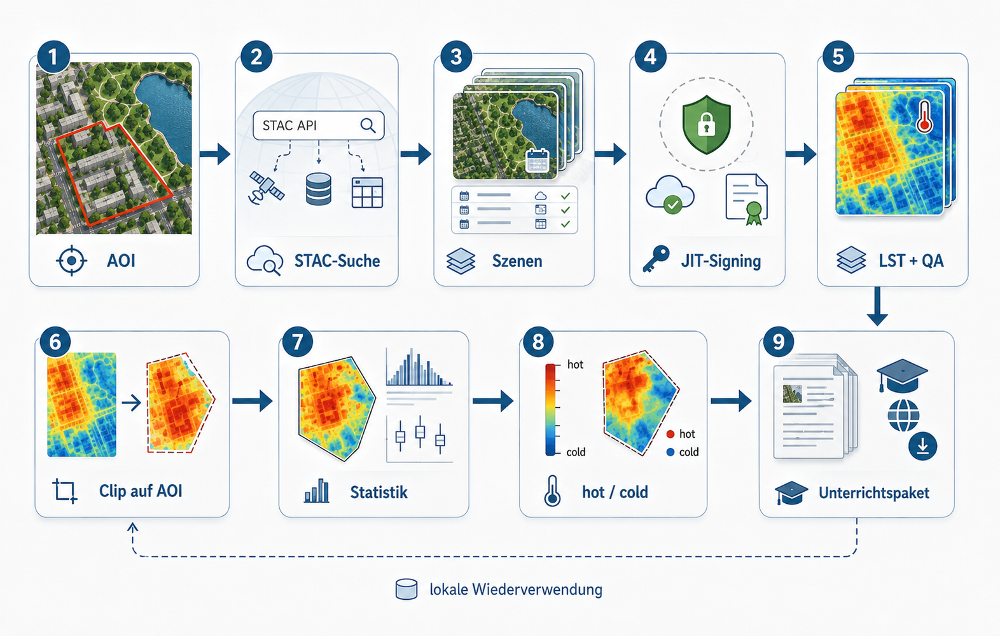

# Inhaltliche Projektbeschreibung

Diese Unterrichtseinheit untersucht, wie sich städtische Oberflächen in ihrer Temperatur unterscheiden. Die Lernenden arbeiten zuerst mit einem Luftbild. Sie markieren auf einer transparenten Folie Gebäude, Parks, Wasserflächen, große Straßen, Gewerbeflächen, offene Böden oder andere auffällige Oberflächen. Danach legen sie dieselbe Folie auf eine Karte der Land Surface Temperature, kurz LST. So wird sichtbar, welche markierten Oberflächen eher heiß oder eher kühl erscheinen.

Die fachliche Aufgabe ist bewusst einfach formuliert: **Welche Oberflächen sind wo heißer oder kühler, und welche räumlichen Muster entstehen daraus?** Die Lernenden sollen nicht zuerst GIS-Bedienung lernen. Sie sollen sehen, beschreiben, messen, vergleichen und begründen.

Die folgende Grafik zeigt nur den Kernablauf der Unterrichtsidee. Überschrift und Erläuterung bleiben absichtlich im Text, damit sie in Quarto leicht bearbeitet werden können.

{fig-align="center" width="95%"}

Das Projekt verbindet drei Beobachtungsebenen. Die erste Ebene ist das **Luftbild**. Es zeigt die sichtbare Stadtoberfläche. Die zweite Ebene ist die **eigene Markierung auf Folie**. Sie hält fest, welche Materialien oder Nutzungen die Lernenden erkannt haben. Die dritte Ebene ist die **LST-Karte**. Sie zeigt, welche Oberflächen zum Satellitenaufnahmezeitpunkt wärmer oder kühler waren.

Das Ergebnis ist keine perfekte Klimakarte. Das Ergebnis ist eine begründete räumliche Interpretation: Die Lernenden können benennen, welche Oberflächen mit hohen oder niedrigen LST-Werten zusammenfallen, welche Stadtbereiche als heiße oder kühle Muster auffallen und welche Prozesse dafür plausibel sind.

# Was ist LST meteorologisch?

**LST bedeutet Land Surface Temperature.** Gemeint ist die Temperatur der Erdoberfläche, wie sie ein Satellit im thermischen Infrarotbereich erfasst. Die Messung bezieht sich auf sichtbare oder thermisch wirksame Oberflächen: Dächer, Asphalt, Baumkronen, Wiesen, offene Böden, Wasserflächen oder versiegelte Plätze.

LST ist **nicht** dasselbe wie Lufttemperatur. Lufttemperatur wird typischerweise in etwa zwei Metern Höhe, belüftet und möglichst im Schatten gemessen. LST beschreibt dagegen die Temperatur der Oberfläche selbst. Deshalb kann eine Asphaltfläche sehr heiß erscheinen, während die Lufttemperatur daneben deutlich niedriger ist.

Die nächste Grafik reduziert diese Unterscheidung auf das Wesentliche: Die Sonne erwärmt Oberflächen, der Satellit misst das thermische Signal der Oberfläche, die Lufttemperatur ist eine andere Messgröße.

{fig-align="center" width="95%"}

Für den Unterricht ist genau diese Unterscheidung zentral. Stadtklima wird nicht nur als abstrakter Temperaturwert behandelt. Es wird an konkrete Oberflächen gebunden: Versiegelung, Vegetation, Wasser, Schatten, Bebauungsdichte und Materialeigenschaften.

LST eignet sich besonders gut, um räumliche Kontraste sichtbar zu machen. Große versiegelte Flächen, dunkle Dächer oder breite Verkehrsflächen erscheinen häufig warm. Parks, Baumflächen oder Wasserflächen erscheinen häufig kühler. Das sind aber keine mechanischen Regeln. Feuchte, Verschattung, Tageszeit, Jahreszeit, Oberflächenmaterial und die konkrete Satellitenszene beeinflussen das Ergebnis.

# Glossar für die Unterrichtseinheit

**AOI**  
Area of Interest. Das ist das Untersuchungsgebiet, zum Beispiel Köln, ein Stadtbezirk oder ein selbst gewählter Kartenausschnitt.

**LST**  
Land Surface Temperature. Temperatur der Oberfläche, gemessen beziehungsweise abgeleitet aus thermischer Infrarotstrahlung.

**Lufttemperatur**  
Temperatur der Luft, meist als Messwert in etwa zwei Metern Höhe verstanden. Sie ist nicht identisch mit LST.

**Oberfläche**  
Das, was der Satellit thermisch sieht: Asphalt, Dach, Baumkrone, Wiese, Wasser, offener Boden und ähnliche Flächen.

**Versiegelung**  
Flächen wie Asphalt, Beton, Pflaster oder Dächer. Sie lassen kaum Wasser in den Boden und erwärmen sich oft stark.

**Vegetation**  
Pflanzenflächen wie Wiesen, Parks, Bäume oder Wald. Sie können über Schatten und Verdunstung kühlend wirken.

**Verdunstung**  
Wasser geht in die Atmosphäre über. Dafür wird Energie benötigt; dadurch kann die Oberfläche kühler bleiben.

**Schatten**  
Reduziert direkte Sonneneinstrahlung. Schattenbereiche können deutlich andere LST-Werte zeigen als direkt beschienene Flächen.

**Komposit**  
Eine zusammenfassende Karte aus mehreren Satellitenszenen. Sie ist robuster als eine einzelne Szene, weil einzelne Ausreißer weniger stark wirken.

**Perzentil**  
Ein statistischer Schwellenwert. Das 90%-Perzentil beschreibt einen hohen, aber nicht extrem ausreißeranfälligen Wert. Es ist für „heißeste“ Situationen oft besser als ein einzelnes Maximum.

**Wolkenmaske**  
Ein Filter, der Wolken, Wolkenschatten und ungültige Bildbereiche entfernt. Ohne diese Maske können LST-Karten falsch interpretiert werden.

**OSM**  
OpenStreetMap. Daraus können Gebäude, Grünflächen, Wasserflächen oder Straßen als Orientierungsebenen genutzt werden.

# Lernziele

Die Einheit verfolgt drei zusammenhängende Lernziele. Erstens sollen die Lernenden Oberflächen im Luftbild qualitativ erkennen und benennen. Zweitens sollen sie LST-Werte quantitativ aus Karte und Legende ablesen und einfachen Oberflächenklassen zuordnen. Drittens sollen sie räumlich-geographische Muster und Prozesse erklären.

Die Grafik zeigt diese drei Lernrichtungen in verdichteter Form. Die ausführliche Beschreibung der Ziele bleibt im Fließtext und ist dadurch im `.qmd` leicht anpassbar.

{fig-align="center" width="95%"}

## Qualitative Zuordnung

Die Lernenden erkennen auf dem Luftbild unterschiedliche Oberflächen und Nutzungen. Sie markieren zum Beispiel dichte Bebauung, große Dächer, Straßenräume, Parks, Baumgruppen, Wasserflächen oder offene Böden. Diese Zuordnung erfolgt zunächst ohne Temperaturkarte. Dadurch entstehen eigene Hypothesen.

## Quantitative Zuordnung

Die Lernenden lesen aus der LST-Karte Temperaturbereiche ab und ordnen diese den markierten Oberflächen zu. Dabei geht es nicht um eine Scheingenauigkeit einzelner Pixel. Entscheidend ist die sinnvolle Zuordnung von Bereichen: eher heiß, mittel, eher kühl, auffällig abweichend.

## Räumlich-geographische Muster und Prozesse

Die Lernenden beschreiben, ob heiße und kühle Bereiche räumlich zusammenhängen. Sie prüfen zum Beispiel, ob große versiegelte Flächen Wärmeinseln bilden, ob Parks als kühlere Inseln erscheinen, ob der Rhein anders wirkt als angrenzende Uferflächen oder ob Stadtbezirke deutliche Unterschiede zeigen.

## Erwartetes Lernprodukt

Am Ende entsteht eine interpretierte Karte oder ein kurzer Ergebnisbogen. Darin benennen die Lernenden mindestens drei Oberflächenklassen, ordnen ihnen Temperaturtendenzen zu und erklären ein räumliches Muster mit mindestens einem Prozess, zum Beispiel Verdunstung, Verschattung, Versiegelung oder Wärmespeicherung.

# Typische Material-Temperatur-Zuordnungen

Die folgende Übersicht dient als Einstieg. Sie ist keine feste Regelkarte. Die Lernenden sollen sie als Erwartung nutzen und anschließend mit der echten Karte prüfen.

{fig-align="center" width="95%"}

Wichtig ist die Formulierung „typisch“ oder „häufig“. Eine Wasserfläche kann tagsüber kühl erscheinen, nachts aber anders wirken. Eine Wiese kann kühl sein, wenn sie feucht und vital ist, aber wärmer, wenn sie trocken ist. Ein Dach kann je nach Material, Farbe und Exposition sehr unterschiedliche Werte zeigen. Gerade diese Abweichungen sind didaktisch wertvoll, weil sie zur Begründung zwingen.

# Was mit dem vorbereiteten Paket geht

Das Skript erzeugt aus wenigen Eingaben ein lokales Datenpaket. Oben werden Untersuchungsgebiet, Zeitraum und Extremmodus gesetzt. Danach werden passende Landsat-Szenen gesucht, lokal verarbeitet, maskiert, zugeschnitten und als Unterrichtsmaterial vorbereitet.

Die Grafik unten reduziert das Paket auf seine Grundlogik: Eingaben links, Verarbeitung in der Mitte, Produkte rechts.

{fig-align="center" width="95%"}

Die drei wichtigsten Entscheidungen sind:

| Entscheidung | Bedeutung für den Unterricht |
|---|---|
| AOI | Welcher Raum wird untersucht? Zum Beispiel Köln, ein Stadtbezirk oder das Schulumfeld. |
| Zeitraum | Aus welchem Zeitraum werden Satellitenszenen gesucht? Zum Beispiel Sommerhalbjahr 2020 bis heute. |
| Extremmodus | Werden heiße Szenen, kalte Szenen oder beide Varianten vorbereitet? |

Für eine erste Stunde reicht eine heiße LST-Karte. Für eine längere Einheit ist die Kombination aus heiß und kalt sinnvoller. Dann können die Lernenden prüfen, ob dieselben Oberflächen immer auffällig sind oder ob sich Muster zwischen extrem warmen und kühleren Situationen verschieben.

Das Datenpaket enthält vor allem vier Dinge: LST-Karten, Luftbild-/Orientierungsebenen, Verwaltungsgrenzen und ein vorbereitetes QGIS-Projekt für Druck und digitale Erweiterung.

# Analoge Nutzung im Unterricht

Die analoge Variante ist die wichtigste Einstiegsform. Sie vermeidet, dass die Stunde zu einer GIS-Bedienschulung wird. Die Lernenden arbeiten mit Karten, Folie und Stiften.

Die Grafik macht nur sichtbar, wie dieselbe Ordnung analog und digital gedacht werden kann. Die eigentliche Erläuterung bleibt im Text.

{fig-align="center" width="95%"}

## Material

Benötigt werden ein Ausdruck des Luftbilds mit Stadtbezirksgrenzen, ein Ausdruck der LST-Karte mit demselben Ausschnitt und Maßstab, transparente Folie oder Transparentpapier, Folienstifte und eine einfache Legende zur LST-Karte.

Die Ausdrucke müssen exakt denselben Ausschnitt und Maßstab besitzen. Sonst passt die Folie nicht sauber auf beide Karten. In QGIS sollte deshalb ein festes Drucklayout genutzt werden. Dasselbe Layout wird einmal mit Luftbild und einmal mit LST-Karte ausgegeben.

## Stundenablauf

Die Grafik zeigt den Ablauf in fünf kompakten Schritten. Der Satz unter der Grafik kann in der Quarto-Datei leicht angepasst oder auch ersetzt werden.

{fig-align="center" width="95%"}

Zuerst orientieren sich die Lernenden auf dem Luftbild. Sie suchen Stadtbezirke, den Rhein, große Straßen, Parks oder bekannte Gebäude. Danach markieren sie Oberflächen auf der Folie. Die Temperaturkarte bleibt zunächst verdeckt.

Erst danach wird die Folie auf die LST-Karte gelegt. Die Lernenden vergleichen ihre Markierungen mit der Temperaturverteilung. Sie notieren, welche Oberflächen eher heiß oder eher kühl erscheinen, wo die Karte ihre Erwartung bestätigt und wo sie überrascht.

Die Sicherung sollte nicht nur aus Einzelbeobachtungen bestehen. Sie sollte räumliche Aussagen enthalten: „Im Gewerbegebiet häufen sich hohe Werte“, „Parks bilden kühlere Inseln“, „am Rand großer Grünflächen treten Temperaturübergänge auf“, „breite Verkehrsflächen bilden lineare Wärmemuster“.

## Arbeitsauftrag für Lernende

1. Markiert auf dem Luftbild mindestens fünf unterschiedliche Oberflächen oder Nutzungen.
2. Nutzt unterschiedliche Farben oder Symbole für Gebäude, Straßen, Parks, Wasser und offene Flächen.
3. Legt eure Folie auf die LST-Karte.
4. Ordnet jeder markierten Fläche eine Temperaturtendenz zu: heiß, mittel, kühl oder unklar.
5. Wählt zwei auffällige Bereiche aus und erklärt sie mit Material, Vegetation, Wasser, Schatten oder Bebauungsdichte.
6. Notiert eine Stelle, an der die Karte nicht zu eurer Erwartung passt.

# Digitale Erweiterung für Fortgeschrittene

Die digitale Variante nutzt dasselbe Prinzip wie die Folienarbeit. In QGIS sind die Ebenen nur digital übereinandergelegt. Das Projekt enthält Luftbild, LST-Karten, Stadtbezirke, AOI-Grenze und OSM-Ebenen.

Für Fortgeschrittene können zusätzliche Aufgaben gestellt werden: Ablesen von Temperaturwerten an bestimmten Orten, Vergleich zwischen Stadtbezirken, Kontrolle der eigenen Folienklassifikation mit OSM-Gebäuden oder Grünflächen, Export eigener Kartenausschnitte oder Vergleich von hot- und cold-Produkten.

Wichtig ist die Reihenfolge. Auch in der digitalen Variante sollten die Lernenden nicht sofort alle Layer einschalten. Erst Luftbildanalyse, dann eigene Hypothese, dann LST, danach Kontrolllayer.

# Welche Ausdrucke sinnvoll sind

Für die Grundstunde sind drei Ausdrucke sinnvoll.

| Ausdruck | Inhalt | Zweck |
|---|---|---|
| A | Luftbild + Stadtbezirke + Stadtgrenze | Arbeitskarte für Markierungen auf Folie |
| B | LST-Karte + Stadtbezirke + Stadtgrenze | Vergleichskarte zur Überlagerung |
| C | Legende und kurze Erklärung | Hilfe zur Interpretation der Temperaturfarben |

Für eine Erweiterung können zwei weitere Ausdrucke ergänzt werden: eine OSM-Kontrollkarte mit Gebäuden, Grünflächen, Wasser und Straßen sowie eine zweite LST-Karte aus dem anderen Extremmodus, also kalt statt heiß oder heiß statt kalt.

# Typische Fehlinterpretationen

Die häufigste Fehlinterpretation lautet: „Dort ist die Luft heißer.“ Präziser ist: „Dort ist die Oberfläche in der Satellitenszene wärmer.“ Diese Unterscheidung sollte wiederholt werden.

Eine zweite Fehlinterpretation betrifft einzelne Pixel. Landsat-LST eignet sich nicht für einzelne kleine Objekte wie einen einzelnen Baum oder einen schmalen Gehweg. Die Karte ist stark genug für größere Muster: Parks, Gewerbeflächen, Flussräume, Stadtbezirke, große Verkehrsachsen oder größere Bebauungsstrukturen.

Eine dritte Fehlinterpretation betrifft Kausalität. Eine warme Fläche ist nicht automatisch warm, weil sie versiegelt ist. Versiegelung ist ein plausibler Faktor, aber Material, Farbe, Feuchte, Schatten, Exposition und Tageszeit müssen mitgedacht werden.

# Appendix: Technische Beschreibung

Dieser Abschnitt ist für Lehrkräfte, Projektbetreuung oder fortgeschrittene Gruppen gedacht. Er muss nicht Bestandteil der normalen Unterrichtsstunde sein.

## Scriptflow

Das technische Skript arbeitet mit einem lokalen AOI-Ordner. Der Ordnername wird aus `aoi_name` gebildet. Dadurch liegen alle Daten zu einem Untersuchungsgebiet strukturiert zusammen. Bereits erzeugte Dateien werden wiederverwendet, damit spätere Läufe keine unnötigen Doppelzugriffe auslösen.

Die Grundlogik des aktuellen Skripts enthält drei wichtige Stabilitätsentscheidungen: signierte Planetary-Computer-URLs werden nicht dauerhaft gespeichert, fertige lokale LST-Dateien werden erkannt und wiederverwendet, und numerische STAC-Properties werden robust ausgelesen. Diese Punkte entsprechen dem stabilen Arbeitsstand des Skripts. 

Die technische Grafik zeigt nur die Hauptschritte. Begriffe und Kommentare stehen bewusst außerhalb der Abbildung.

{fig-align="center" width="95%"}

## AOI, Zeitraum und Extremmodus

Der technische Einstieg besteht aus wenigen Variablen. `aoi_name` bestimmt den lokalen Projektordner. `date_start` und `date_end` bestimmen den Suchzeitraum. `seasonal_months` begrenzt die Suche auf bestimmte Monate, zum Beispiel April bis September. `extreme_mode` legt fest, ob heiße, kalte oder beide Extremsituationen ausgewählt werden.

```r
# Beispielhafte Grundkonfiguration

aoi_name <- "koeln"
aoi_mode <- "koeln_stadtbezirke"

date_start <- "2020-01-01"
date_end   <- as.character(Sys.Date())

seasonal_months <- 4:9

extreme_mode <- "both"
n_hot  <- 10
n_cold <- 10
```

## Landsat-Verarbeitung

Das Skript sucht Landsat 8/9 Collection 2 Level-2 Szenen über STAC. Für jede geeignete Szene werden das thermische LST-Asset und das QA-Asset genutzt. Die URL-Signierung erfolgt erst unmittelbar vor dem Zugriff auf eine Szene. Dadurch werden keine alten, abgelaufenen Zugriffstokens in einer langen Verarbeitung verwendet.

Die LST wird aus dem Landsat-Produkt in Grad Celsius umgerechnet. Danach wird die Karte auf das AOI zugeschnitten. Über das QA-Band werden Wolken, Wolkenschatten, Cirrus, Schnee und ungültige Pixel entfernt.

## Ranking heißer und kalter Szenen

Für jede verarbeitete Szene werden statistische Kennwerte im AOI berechnet: Mittelwert, Median, 90%-Perzentil, Maximum und gültiger Pixelanteil. Für heiße Szenen ist das 90%-Perzentil eine robuste Standardmetrik, weil es hohe Temperaturen erfasst, ohne von einzelnen Ausreißerpixeln abhängig zu sein. Für kalte Szenen kann entsprechend ein niedriges Perzentil oder der Median genutzt werden.

## Unterrichtslayer und QGIS-Projekt

Zusätzlich zur LST erzeugt das Paket Orientierungsebenen. Dazu gehören AOI-Grenze, Stadtbezirke oder andere Verwaltungsgrenzen sowie OSM-Layer für Gebäude, Grünflächen, Wasser und Straßen. Für den Unterricht werden diese Ebenen als GeoPackage gespeichert. Das QGIS-Projekt nutzt diese Daten gemeinsam mit dem Luftbild und den LST-Rastern.

## Lokale Ordnerstruktur

Die lokale Struktur folgt diesem Prinzip:

```text
data/landsat_lst/<aoi_name>/
├── 00_config/
├── 01_aoi/
├── 02_stac/
├── 03_landsat_scenes/
├── 04_extremes/
│   ├── hot/
│   └── cold/
├── 05_teaching_layers/
├── 06_qgis_project/
├── 99_logs/
└── manifest.json
```

`manifest.json` dient als technischer Wegweiser. Dort können Pfade zu AOI, LST-Produkten, Unterrichtslayern und QGIS-Projektdateien dokumentiert werden.

# Appendix: Kopiervorlage für Lernende

## Beobachtungsbogen

**Untersuchungsgebiet:**  

**Datum / Szene:**  

**1. Welche Oberflächen habt ihr markiert?**  

-  
-  
-  
-  
-  

**2. Welche davon erscheinen eher heiß?**  

-  
-  
-  

**3. Welche erscheinen eher kühl?**  

-  
-  
-  

**4. Welches räumliche Muster fällt auf?**  


**5. Wie erklärt ihr dieses Muster?**  


**6. Wo passt die Karte nicht zu eurer Erwartung?**  


