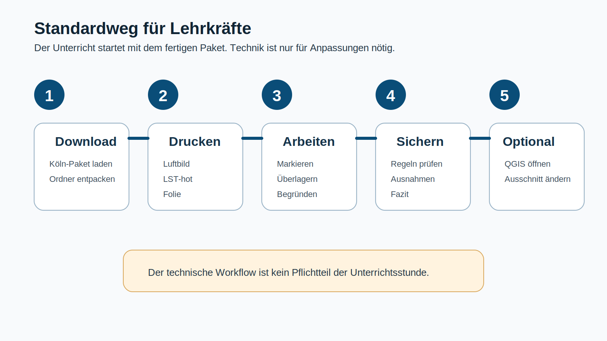
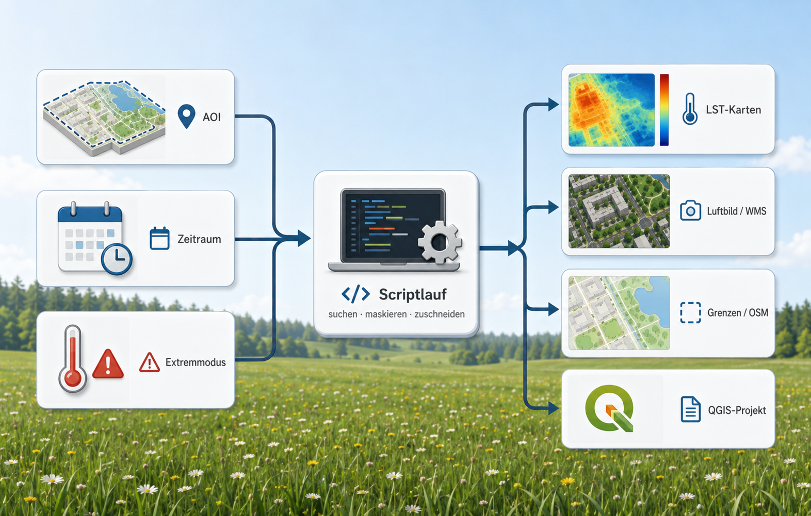
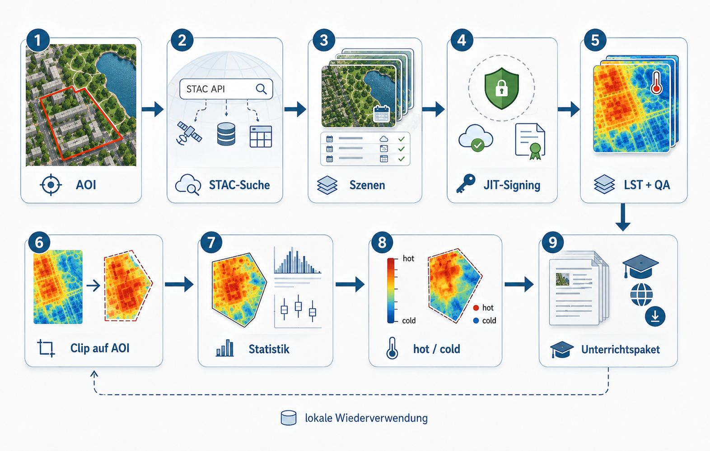

# Zweck dieser Seite

Der Konfigurator ist ein Hilfswerkzeug für Lehrkräfte, die ein eigenes LST-Materialpaket erzeugen möchten. Er berechnet keine Karten im Browser. Er erzeugt nur eine saubere Konfiguration für den lokalen R-Workflow.

Für den direkten Unterrichtseinsatz ist diese Seite nicht notwendig. Dafür reicht das vorbereitete Köln-Demo-Paket. Der Konfigurator ist sinnvoll, wenn ein anderer Ausschnitt, ein anderer Zeitraum oder ein eigenes AOI getestet werden soll.

Die aktuelle Version ist auf den reduzierten Unterrichtsworkflow ausgerichtet: **Hot-LST q90**, **DOP-RGB**, **DOP-CIR-Oberflächenmaske** und **vier passgenaue QGIS-Printlayouts**. Cold-Produkte und OSM-Zusatzlayer werden hier nicht mehr als Standardoption geführt.

{fig-align="center" width="95%"}

# Was wird konfiguriert?

Der Konfigurator beschreibt vier Entscheidungen:

1. Welcher Raum wird analysiert?
2. Aus welchem Zeitraum werden Landsat-Szenen gesucht?
3. Nach welcher heißen Temperaturtendenz werden Szenen ausgewählt?
4. Soll danach automatisch ein QGIS-Projekt mit Printlayouts erzeugt werden?

{fig-align="center" width="95%"}

Die technische Umsetzung bleibt lokal. Der Browser erzeugt nur JSON oder einen R-Konfigurationsblock. Die eigentliche Verarbeitung läuft über:

```bash
Rscript scripts/00_run_lst_oberflaechenmaske_dop_cir.R
```

Am Ende kann dieses Skript den QGIS-Launcher starten:

```text
scripts/run_create_qgis_project.sh
scripts/run_create_qgis_project.bat
```

# Konfigurator

```{=html}
<style>
.config-grid { display: grid; grid-template-columns: 1fr 1fr; gap: 1rem; margin: 1rem 0; }
.config-card { border: 1px solid #c8d2dc; border-radius: 14px; padding: 1rem; background: #f8fafc; }
.config-card h3 { margin-top: 0; }
.config-card p { color: #334; }
.config-card label { display: block; font-weight: 700; margin-top: .7rem; }
.config-card input, .config-card select { width: 100%; padding: .45rem; border: 1px solid #b7c4cf; border-radius: 8px; }
.config-actions { margin: 1rem 0; display: flex; gap: .75rem; flex-wrap: wrap; }
.config-actions button { padding: .65rem 1rem; border-radius: 10px; border: 1px solid #2f4558; background: #2f78b7; color: white; font-weight: 700; cursor: pointer; }
.config-actions button.secondary { background: #506577; }
textarea.config-output { width: 100%; min-height: 360px; font-family: monospace; font-size: .9rem; }
.hint { background:#fff3df; border:1px solid #d9a85d; border-radius:12px; padding:.8rem; margin:.8rem 0; }
.note { background:#edf7ed; border:1px solid #8ebf8e; border-radius:12px; padding:.8rem; margin:.8rem 0; }
</style>

<div class="hint">
  <strong>Empfehlung für den ersten eigenen Lauf:</strong> kleine AOI, Sommermonate Juni–August, Hot-Modus q90, DOP-CIR-Maske aktiv, QGIS-Projekt automatisch erzeugen.
</div>

<div class="note">
  <strong>Aktueller Unterrichtsstandard:</strong> Es werden drei Oberflächenklassen verwendet: Vegetation, Wasser und Versiegelung / Bebauung. Die QGIS-Ausgabe nutzt nur das Hot-q90-Produkt.
</div>

<div class="config-grid">
  <div class="config-card">
    <h3>1. Untersuchungsraum</h3>
    <p>Der AOI bestimmt, für welchen Raum LST-Produkte, DOP-CIR-Maske und QGIS-Layouts erzeugt werden.</p>

    <label>AOI-Name</label>
    <input id="aoi_name" value="koeln">

    <label>AOI-Modus</label>
    <select id="aoi_mode" onchange="updateVisibility()">
      <option value="koeln_stadtbezirke">Köln Stadtbezirke</option>
      <option value="bbox">Bounding Box</option>
      <option value="file">eigene Datei im Skript setzen</option>
    </select>

    <div id="bbox_box">
      <label>Bounding Box xmin</label><input id="xmin" value="6.75">
      <label>Bounding Box ymin</label><input id="ymin" value="50.82">
      <label>Bounding Box xmax</label><input id="xmax" value="7.20">
      <label>Bounding Box ymax</label><input id="ymax" value="51.10">
    </div>
  </div>

  <div class="config-card">
    <h3>2. Zeitraum und Szenenfilter</h3>
    <p>Für Stadtwärme sind Sommermonate am sinnvollsten. Der aktuelle Köln-Demo-Workflow nutzt Juni bis August.</p>

    <label>Startdatum</label>
    <input id="date_start" type="date" value="2023-01-01">

    <label>Enddatum</label>
    <input id="date_end" type="date" value="2026-01-01">

    <label>Monate</label>
    <select id="season">
      <option value="summer_jja">Sommer Juni–August</option>
      <option value="extended_summer">Sommerhalbjahr April–September</option>
      <option value="year">Ganzes Jahr</option>
    </select>

    <label>max. Szenen-Wolkenanteil [%]</label>
    <input id="max_scene_cloud" type="number" min="0" max="100" value="30">
  </div>

  <div class="config-card">
    <h3>3. Hot-LST-Produkt</h3>
    <p>Der aktuelle Unterrichtsworkflow nutzt nur den Hot-Modus. Szenen werden nach hoher q90-Temperatur ausgewählt.</p>

    <label>Extremmodus</label>
    <select id="extreme_mode">
      <option value="hot">hot / heiße Szenen</option>
    </select>

    <label>Hot-Metrik</label>
    <select id="hot_metric">
      <option value="q90_C">q90_C / obere Temperaturtendenz</option>
    </select>

    <label>Anzahl heißer Szenen</label>
    <input id="n_hot" type="number" min="1" max="30" value="10">

    <label>Mindestzahl gültiger Pixel</label>
    <input id="min_valid_pixels" type="number" min="1" value="500">
  </div>

  <div class="config-card">
    <h3>4. DOP-CIR-Maske und QGIS-Ausgabe</h3>
    <p>Die DOP-CIR-Maske erzeugt drei didaktische Oberflächenklassen. Danach kann automatisch das QGIS-Projekt mit Printlayouts erstellt werden.</p>

    <label>DOP-CIR-Maske erzeugen</label>
    <select id="dop_cir_mask">
      <option value="true">ja</option>
    </select>

    <label>DOP-CIR-Zielauflösung [m]</label>
    <input id="dop_cir_target_res_m" type="number" min="1" value="30">

    <label>QGIS-Projekt und Printlayouts erzeugen</label>
    <select id="run_qgis_project">
      <option value="true">ja</option>
      <option value="false">nein</option>
    </select>

    <label>LST-Deckkraft im QGIS-Projekt</label>
    <input id="lst_project_opacity" type="number" min="0" max="1" step="0.05" value="1.0">
  </div>
</div>

<div class="config-actions">
  <button onclick="makeJSON()">JSON erzeugen</button>
  <button onclick="makeR()" class="secondary">R-Block erzeugen</button>
  <button onclick="downloadJSON()" class="secondary">run_config.json herunterladen</button>
</div>

<textarea id="output" class="config-output"></textarea>

<script>
function boolVal(id) { return document.getElementById(id).value === 'true'; }
function numVal(id) { return Number(document.getElementById(id).value); }
function strVal(id) { return document.getElementById(id).value; }

function months() {
  const season = strVal('season');
  if (season === 'summer_jja') return [6,7,8];
  if (season === 'extended_summer') return [4,5,6,7,8,9];
  return [1,2,3,4,5,6,7,8,9,10,11,12];
}

function updateVisibility() {
  const mode = strVal('aoi_mode');
  document.getElementById('bbox_box').style.display = mode === 'bbox' ? 'block' : 'none';
}

function configObj() {
  let end = strVal('date_end');
  if (!end) end = new Date().toISOString().slice(0,10);

  return {
    aoi_name: strVal('aoi_name'),
    aoi_mode: strVal('aoi_mode'),
    project_root: 'data/landsat_lst',

    date_start: strVal('date_start'),
    date_end: end,
    seasonal_months: months(),

    crs_qgis: 25832,
    crs_lucc: 3035,

    extreme_mode: 'hot',
    n_hot: numVal('n_hot'),
    hot_metric: strVal('hot_metric'),

    max_scene_cloud: numVal('max_scene_cloud'),
    require_tier1: true,
    require_l2sp: true,
    min_valid_pixels: numVal('min_valid_pixels'),
    mask_water: false,

    aerial_source_mode: 'both',
    aerial_wms_name: 'Luftbild NRW DOP RGB WMS',
    aerial_wms_url: 'https://www.wms.nrw.de/geobasis/wms_nw_dop?language=ger',
    aerial_wms_layer: 'nw_dop_rgb',

    dop_cir_mask: boolVal('dop_cir_mask'),
    dop_cir_wms_layer: 'nw_dop_cir',
    dop_cir_target_res_m: numVal('dop_cir_target_res_m'),
    dop_cir_classes: ['Vegetation', 'Wasser', 'Versiegelung / Bebauung'],

    run_qgis_project_creation: false,
    run_external_qgis_project: boolVal('run_qgis_project'),
    qgis_project_script: 'scripts/create_qgis_project.py',
    qgis_linux_launcher: 'scripts/run_create_qgis_project.sh',
    qgis_windows_launcher: 'scripts/run_create_qgis_project.bat',
    lst_project_opacity: numVal('lst_project_opacity'),

    aoi_bbox: {
      xmin: Number(strVal('xmin')),
      ymin: Number(strVal('ymin')),
      xmax: Number(strVal('xmax')),
      ymax: Number(strVal('ymax'))
    }
  };
}

function makeJSON() {
  document.getElementById('output').value = JSON.stringify(configObj(), null, 2);
}

function makeR() {
  const c = configObj();
  const m = 'c(' + c.seasonal_months.join(', ') + ')';

  const r = `aoi_name <- "${c.aoi_name}"
aoi_mode <- "${c.aoi_mode}"
project_root <- file.path("data", "landsat_lst")

aoi_file  <- NA_character_
aoi_layer <- NA_character_

aoi_bbox <- c(
  xmin = ${c.aoi_bbox.xmin},
  ymin = ${c.aoi_bbox.ymin},
  xmax = ${c.aoi_bbox.xmax},
  ymax = ${c.aoi_bbox.ymax}
)

admin_file  <- NA_character_
admin_layer <- NA_character_

date_start <- "${c.date_start}"
date_end   <- "${c.date_end}"
seasonal_months <- ${m}

crs_qgis <- 25832
crs_lucc <- 3035

extreme_mode <- "hot"
n_hot <- ${c.n_hot}
hot_metric <- "${c.hot_metric}"

max_scene_cloud <- ${c.max_scene_cloud}
require_tier1 <- TRUE
require_l2sp  <- TRUE
max_candidates <- Inf

mask_water <- FALSE
min_valid_pixels <- ${c.min_valid_pixels}
skip_existing_outputs <- TRUE

aerial_source_mode <- "both"
aerial_wms_name  <- "Luftbild NRW DOP RGB WMS"
aerial_wms_url   <- "https://www.wms.nrw.de/geobasis/wms_nw_dop?language=ger"
aerial_wms_layer <- "nw_dop_rgb"

aerial_opacity <- 1.0
aerial_rgb_format <- "image/png"
aerial_rgb_max_dim <- 6000
aerial_rgb_target_res_m <- 2

# Der alte interne QGIS-Aufruf bleibt deaktiviert.
# Das QGIS-Projekt wird über scripts/run_create_qgis_project.* gestartet.
run_qgis_project_creation <- FALSE
run_external_qgis_project <- ${c.run_external_qgis_project ? 'TRUE' : 'FALSE'}

# DOP-CIR-Oberflächenmaske
dop_cir_target_res_m <- ${c.dop_cir_target_res_m}

# QGIS-Projektlogik:
# Nur Hot LST q90, DOP RGB, Kartenrahmen und DOP-CIR-Maskenlayer.
lst_project_opacity <- ${c.lst_project_opacity}`;

  document.getElementById('output').value = r;
}

function downloadJSON() {
  const data = JSON.stringify(configObj(), null, 2);
  const blob = new Blob([data], {type: 'application/json'});
  const url = URL.createObjectURL(blob);
  const a = document.createElement('a');
  a.href = url;
  a.download = 'run_config.json';
  a.click();
  URL.revokeObjectURL(url);
}

window.addEventListener('load', () => {
  updateVisibility();
  makeJSON();
});
</script>
```

# Nutzung

Der erzeugte R-Block kann in den Konfigurationsteil von `scripts/00_run_lst_oberflaechenmaske_dop_cir.R` übernommen werden. Alternativ kann die JSON-Ausgabe als Dokumentation der gewählten Parameter gespeichert werden.

Der Browser erzeugt keine LST-Karte und keine Maske. Die Verarbeitung läuft lokal. Für die Köln-Demo ist der zentrale Start:

```bash
Rscript scripts/00_run_lst_oberflaechenmaske_dop_cir.R
```

Wenn `run_external_qgis_project <- TRUE` gesetzt ist, startet der R-Runner anschließend den passenden QGIS-Launcher und erzeugt das QGIS-Projekt mit vier Printlayouts.

# Was der aktuelle Workflow erzeugt

{fig-align="center" width="95%"}

Der konfigurierte Workflow erzeugt:

```text
AOI
→ Landsat-LST-Szenen
→ Auswahl heißer Szenen nach q90_C
→ Hot-q90-Komposit
→ DOP-CIR-Oberflächenmaske mit drei Klassen
→ QGIS-Projekt
→ vier passgleiche Drucklayouts
```

Die didaktische Reduktion bleibt in allen Ausgaben gleich:

```text
Vegetation
Wasser
Versiegelung / Bebauung
```

{fig-align="center" width="95%"}

# Hinweise zur Anpassung

Für eigene Räume sollte zuerst mit einer kleinen AOI getestet werden. Große Stadtgebiete erhöhen Downloadzeit, WMS-Last, Rastergröße und QGIS-Exportzeit. Der DOP-CIR-WMS wird für die Maske auf ein Zielraster geladen. Im Standard sind das 30 m, weil die Maske didaktisch zur Landsat-LST-Ebene passen soll.

Das QGIS-Projekt nutzt in der aktuellen Fassung nur noch:

```text
koeln_LST_hot_q90_C_EPSG25832.tif
koeln_dop_cir_30m_3klassen.gpkg
DOP RGB WMS
Kartenrahmen-Layer
```

Die übrigen LST-Produkte können weiterhin als Zwischenprodukte entstehen, werden aber nicht in das reduzierte Unterrichtsprojekt geladen.

# Technische Grenzen

Der Konfigurator ersetzt keine Plausibilitätsprüfung. Nach jedem neuen Lauf sollten diese Punkte kontrolliert werden:

- Gibt es genügend gültige Landsat-Pixel?
- Ist die AOI nicht zu groß?
- Wurde das DOP-CIR-WMS vollständig geladen?
- Sind Wasser und Vegetation in der Maske plausibel?
- Stimmen Kartenrahmen und Ausdrucke im QGIS-Layout überein?
- Wurde beim Drucken `100 % / tatsächliche Größe` verwendet?

Wenn das DOP in der QGIS-Layoutvorschau grob erscheint, ist zuerst der PDF-Export zu prüfen. Die Vorschau kann WMS-Layer gröber darstellen als der finale Export. Wenn auch der PDF grob ist, sollte für den festen Kartenausschnitt ein lokales, hochaufgelöstes DOP-Raster verwendet werden.

# Git-Hinweis

Die erzeugten Daten gehören nicht ins Repository. In `.gitignore` sollten mindestens diese Einträge stehen:

```gitignore
/data/
/.venv-folienvorlage/
```

Das Repository sollte Skripte, Quarto-Seiten und Abbildungen enthalten, nicht Landsat-Szenen, DOP-Downloads, GeoPackages, QGIS-Projektdateien oder Print-PDFs.
