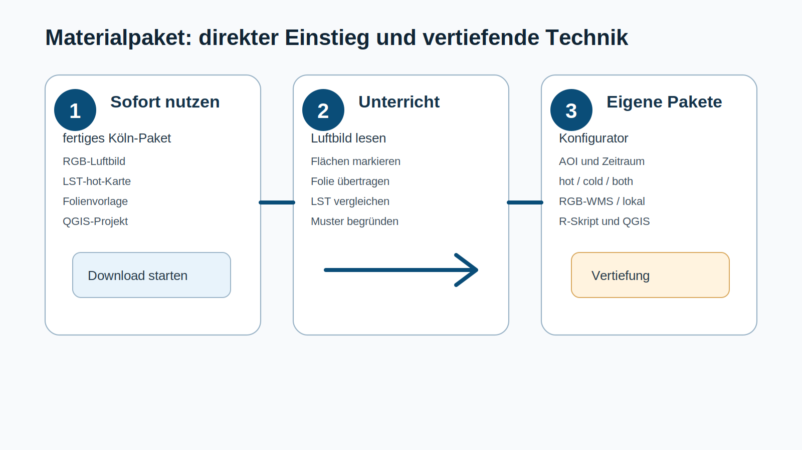
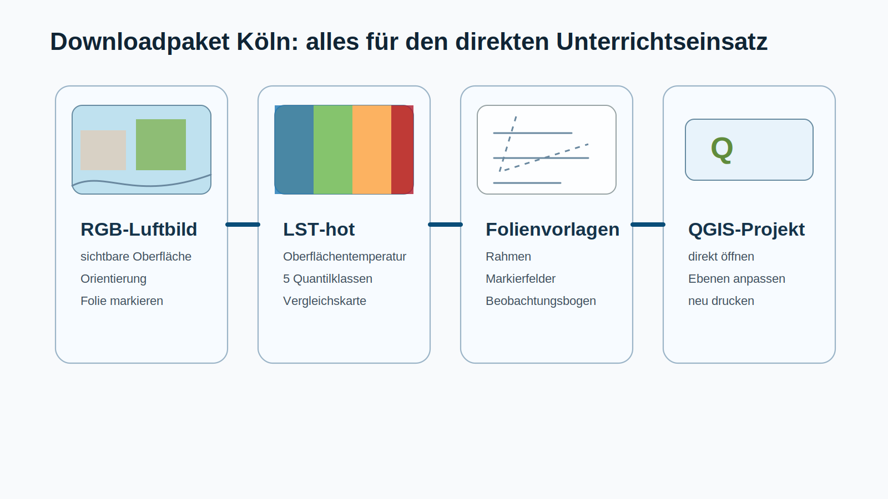

# Zweck dieser Handreichung

Diese Seite beschreibt die Unterrichtsidee und den fachlichen Kern der Einheit. Sie richtet sich an Lehrkräfte, die mit dem vorbereiteten Materialpaket direkt arbeiten möchten. Die technische Erzeugung eigener Datenpakete ist nicht Voraussetzung für die Durchführung der Stunde.

Die Grundidee ist bewusst einfach gehalten: Die Lernenden lesen zuerst ein RGB-Luftbild, markieren sichtbare Oberflächen auf transparenter Folie und legen dieselbe Folie anschließend auf eine LST-Karte. Dadurch entsteht ein direkter Vergleich zwischen sichtbarer Stadtstruktur und gemessener Oberflächentemperatur. Entscheidend ist nicht, einzelne Pixel zu deuten, sondern größere räumliche Muster zu erkennen und plausibel zu erklären.

{fig-align="center" width="95%"}

Die Trennung ist wichtig. Für den Unterricht soll zunächst kein GIS- oder Skriptproblem entstehen. Das fertige Paket liefert die nötigen Karten. QGIS, Konfigurator und Skript sind für Lehrkräfte gedacht, die später eigene Ausschnitte, andere Städte oder andere Zeiträume vorbereiten möchten.

# Sofort loslegen: vorbereitetes Materialpaket Köln

Für die erste Durchführung liegt ein vorbereitetes Beispielpaket für Köln vor. Es enthält die Materialien, mit denen eine Lerngruppe ohne technische Vorbereitung arbeiten kann: ein farbiges Luftbild, eine heiße Oberflächentemperaturkarte im gleichen Ausschnitt, eine Markiervorlage für transparente Folie und ein vorbereitetes QGIS-Projekt als editierbarer Hintergrund.

[Materialpaket Köln herunterladen](../downloads/lst_materialpaket_koeln_demo.zip){.btn .btn-primary}

Das Archiv ist hier als Dummy-Download angelegt. Es zeigt die Zielstruktur des späteren echten Pakets. Inhaltlich soll dieses Paket so aufgebaut sein, dass Lehrkräfte mit den Druckvorlagen unmittelbar starten können. Das QGIS-Projekt ist nur nötig, wenn Ausschnitte, Legenden oder Drucklayouts angepasst werden sollen.

{fig-align="center" width="95%"}

Für die Grundstunde reichen drei Ausdrucke: das RGB-Luftbild, die LST-hot-Karte und die Folien- oder Transparentpapiervorlage. Alle drei müssen denselben Ausschnitt und denselben Maßstab verwenden. Die Lernenden markieren nicht auf der Karte selbst, sondern auf einer transparenten Ebene. Dadurch bleibt sichtbar, dass ihre Deutung eine eigene Interpretationsebene ist.

# Was LST fachlich bedeutet

LST steht für Land Surface Temperature. Gemeint ist die Temperatur der Oberfläche, nicht die Lufttemperatur in zwei Metern Höhe. Ein Satellit misst thermische Strahlung, aus der für geeignete Oberflächen eine Oberflächentemperatur abgeleitet wird. Diese Größe reagiert stark auf Material, Feuchte, Vegetation, Schatten, Exposition und Tageszeit.

{fig-align="center" width="95%"}

Für den Unterricht ist diese Unterscheidung zentral. Eine Asphaltfläche kann auf der Karte sehr warm erscheinen, obwohl die Lufttemperatur daneben deutlich niedriger ist. Die Karte zeigt also nicht, wo Menschen exakt welche Lufttemperatur erleben. Sie zeigt, welche Oberflächen im betrachteten Moment stärker oder schwächer erwärmt sind. Genau daraus lassen sich räumliche Muster der Stadtoberfläche diskutieren.

# Lernziele der Einheit

Die Lernenden sollen Oberflächen im Luftbild erkennen, ihnen Oberflächentemperaturen aus der LST-Karte zuordnen und räumliche Muster prozesshaft erklären. Die Aufgabe verbindet damit qualitative Kartenauswertung, quantitative Zuordnung und geographische Erklärung.

{fig-align="center" width="95%"}

Der fachliche Zielpunkt ist eine begründete Karte oder ein begründeter Ergebnisbogen. Die Lernenden sollen nicht nur sagen, dass eine Fläche rot oder blau ist. Sie sollen beschreiben, welche Oberfläche dort liegt, welche Temperaturtendenz sichtbar wird und welche Erklärung plausibel ist. Gute Begründungen bleiben vorsichtig: Sie formulieren Tendenzen, prüfen Ausnahmen und vermeiden zu einfache Kausalsätze.

# Typische Temperaturtendenzen

Die folgende Übersicht dient als Erwartungsrahmen. Sie ist keine feste Regelkarte. Eine Wiese kann trocken und warm sein, ein Dach kann hell und vergleichsweise kühl erscheinen, und Wasserflächen folgen einer anderen Tagesdynamik als Asphalt. Die Übersicht hilft, erste Vermutungen zu bilden, die anschließend an der echten Karte geprüft werden.

{fig-align="center" width="95%"}

Didaktisch ist gerade die Abweichung interessant. Wenn eine erwartbar kühle Fläche warm erscheint, lohnt die Nachfrage: Ist die Fläche trocken? Liegt sie in voller Sonne? Ist sie wirklich Vegetation oder nur scheinbar grün? Wenn eine versiegelte Fläche weniger warm erscheint, können Schatten, Materialfarbe oder Mischpixel eine Rolle spielen.

# Unterrichtsablauf

Die Unterrichtsstunde beginnt mit dem Luftbild. Die LST-Karte wird zunächst nicht gezeigt. Die Lernenden sollen erst selbst Oberflächen erkennen und markieren, bevor sie die Temperaturkarte als Prüfebene nutzen. Dadurch wird verhindert, dass sie nur Farben ablesen. Sie entwickeln zuerst eine eigene Hypothese über die Stadtoberfläche.

{fig-align="center" width="95%"}

Der Ablauf besteht aus fünf Schritten. Zuerst orientieren sich die Lernenden im Ausschnitt. Danach markieren sie unterschiedliche Oberflächen auf der Folie. Erst im dritten Schritt wird die LST-Karte aufgelegt. Im vierten Schritt werden heiße und kühle Bereiche begründet. Im fünften Schritt sichern die Lernenden vorsichtige Regeln und offene Fragen.

{fig-align="center" width="95%"}

Die technische Seite des Pakets ist damit nachgeordnet. Sie unterstützt die Vorbereitung, ersetzt aber nicht die fachliche Arbeit im Klassenraum. Für eine erste Durchführung sollte die Stunde analog bleiben: sehen, markieren, überlagern, begründen.

# Typische Fehlinterpretationen

Die häufigste Fehlinterpretation lautet: „Dort ist die Luft heißer.“ Präziser ist: „Die Oberfläche erscheint in dieser Szene wärmer.“ Diese Unterscheidung sollte wiederholt werden, weil sie den Kern der Fernerkundungsgröße betrifft.

Eine zweite Fehlinterpretation betrifft einzelne Pixel. Landsat-LST eignet sich nicht für die sichere Deutung einzelner kleiner Objekte wie eines einzelnen Baums, einer schmalen Straße oder eines kleinen Innenhofs. Die Karte ist stark genug für größere Muster: Stadtviertel, Parks, Gewerbeflächen, Flussräume, breite Verkehrsachsen oder größere Gebäudestrukturen.

Eine dritte Fehlinterpretation betrifft einfache Ursachen. Versiegelung ist ein wichtiger Faktor, aber nicht allein entscheidend. Feuchte, Vegetation, Schatten, Material, Farbe, Gebäudeform, Gewässernähe und Tageszeit wirken zusammen. Deshalb sollen die Lernenden nicht „beweisen“, sondern plausibel erklären.

# Ergebnis der Stunde

Am Ende steht eine begründete Deutung. Die Lernenden benennen mindestens drei Oberflächenklassen, ordnen ihnen eine Temperaturtendenz zu und erklären ein räumliches Muster mit mindestens einem Prozess. Ein gutes Ergebnis enthält außerdem eine vorsichtig formulierte Regel und eine beobachtete Ausnahme.

Die kurze Sicherung könnte so lauten: Große versiegelte Flächen erscheinen in dieser Szene häufig wärmer als begrünte Flächen. Wasserflächen und größere Parkbereiche erscheinen eher kühl. Einzelne Abweichungen lassen sich durch Schatten, Feuchte, Material oder Mischflächen erklären.
