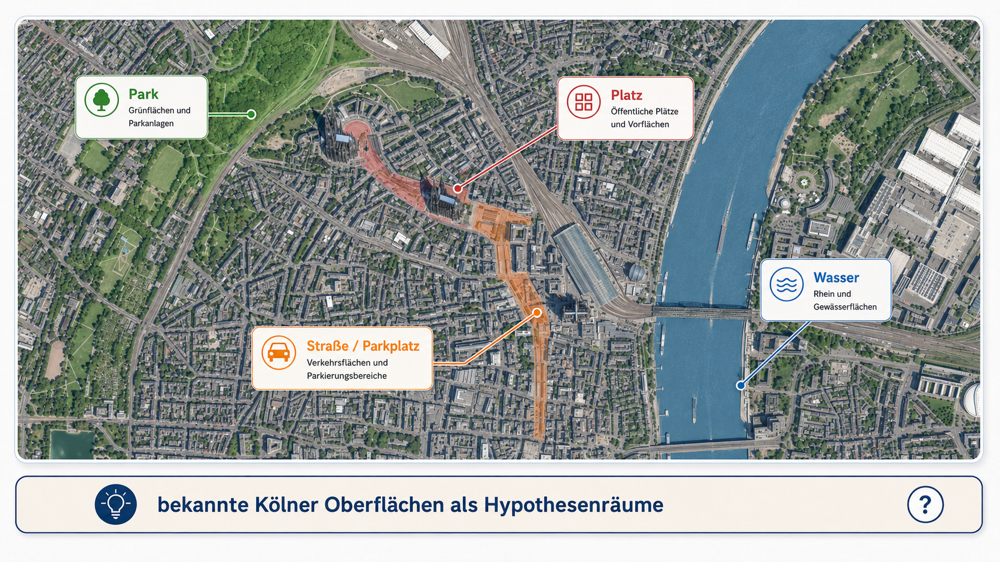
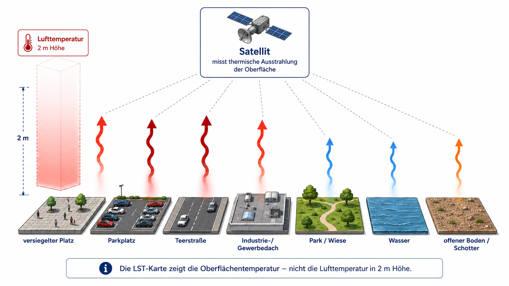
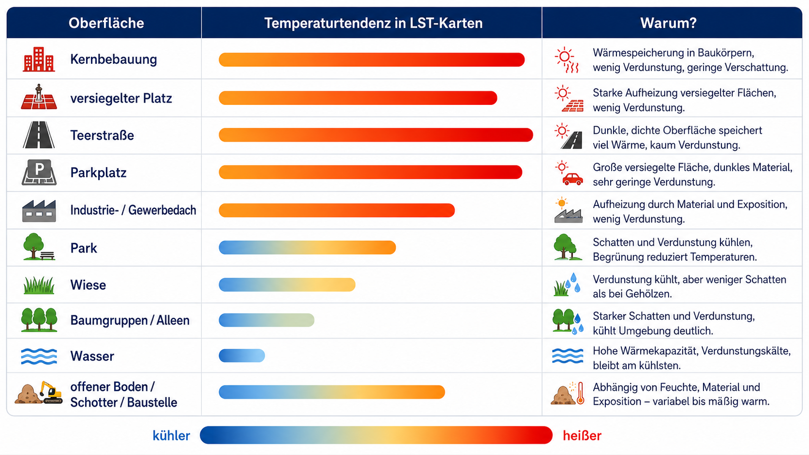
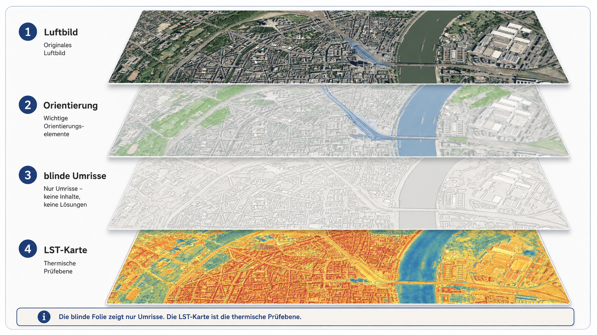
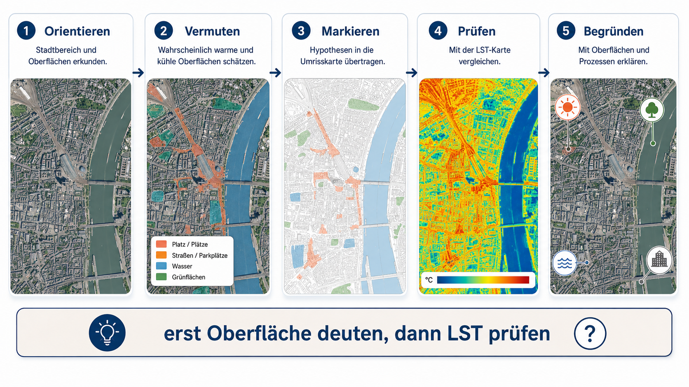
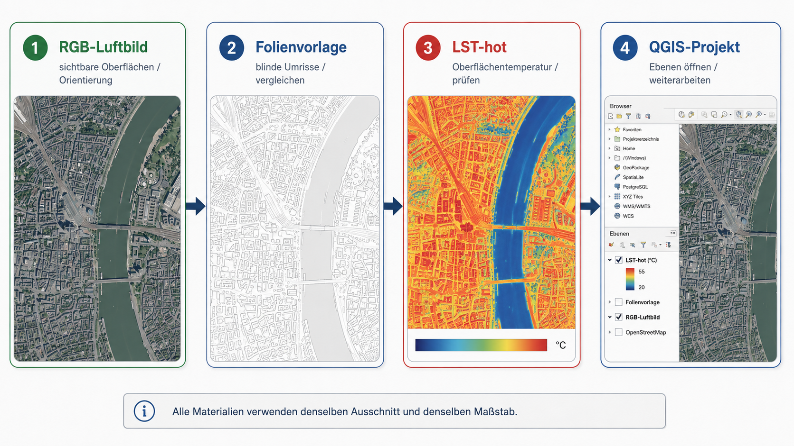

# Worum es in dieser Stunde geht

Köln ist im Sommer kein gleichmäßig warmer Raum. Wer sich an einem heißen Tag durch die Stadt bewegt, erlebt deutliche Unterschiede zwischen großen Platzflächen, breiten Straßen, Parkplätzen, dichten Baublöcken, Gewerbeflächen, Parks, Wiesen, Baumgruppen, dem Rhein und offenen Bodenflächen. Diese Unterschiede lassen sich fachlich als Unterschiede der Oberfläche lesen: Asphalt, Beton, Pflaster, Dachmaterial, Vegetation, Wasser, Schotter und Boden nehmen Strahlung unterschiedlich auf, speichern Wärme unterschiedlich lange und geben Energie unterschiedlich stark über Verdunstung ab.

Die Stadt Köln beschreibt diesen städtischen Wärmehaushalt ausdrücklich als verändert: Gebäude, Straßen und versiegelte Flächen erhitzen sich intensiver und speichern Wärme länger als unbebaute Landschaftsräume ([Stadt Köln: Stadtklima](https://www.stadt-koeln.de/artikel/60838/index.html)). Köln behandelt Hitze außerdem als kommunales Anpassungs- und Gesundheitsthema; das Hitze-Portal verweist darauf, dass sommerliche Hitzeperioden im Klimawandel zunehmen und gesundheitlich belastend sein können ([Stadt Köln: Hitze-Portal](https://www.stadt-koeln.de/leben-in-koeln/umwelt-tiere/klima/hitzeportal/index.html)). Der Kölner Hitzeknigge ordnet Hitze als praktisches Vorsorgethema für die Bevölkerung ein ([Stadt Köln: Hitzeknigge](https://www.stadt-koeln.de/artikel/69221/index.html)). Die Stunde greift diese lokale Relevanz auf, behandelt Hitze aber nicht zuerst als Verhaltensthema, sondern als räumlich sichtbares Oberflächenproblem.

{fig-align="center" width="95%"}

Der Einstieg sollte deshalb nicht lauten: „Hier sieht man die heißesten Orte Kölns.“ Treffender ist: „Welche Oberflächen erkennen wir hier, und welche davon müssten sich an einem sonnigen Sommertag besonders stark erwärmen?“ Die Lernenden sollen zuerst aus dem Luftbild argumentieren. Erst danach wird die LST-Karte als Prüfebene eingesetzt.

# Vom bekannten Ort zur Oberflächenklasse

Für Schülerinnen und Schüler ist Stadthitze zunächst eine Alltagserfahrung. Man sucht Schatten, meidet aufgeheizte Platzflächen, bleibt lieber im Park oder am Wasser und spürt die Hitze an Straßen, Fassaden und Haltestellen. Diese Erfahrung ist ein guter Einstieg, aber sie muss fachlich übersetzt werden. Die zentrale Frage lautet nicht: „Wo fühlt es sich heiß an?“, sondern: „Welche Oberfläche liegt dort, und wie reagiert diese Oberfläche thermisch?“

Ein großer Platz kann aus hellem Pflaster bestehen, wenig Schatten haben und sich stark aufheizen. Eine breite Straße ist nicht nur Verkehrsraum, sondern eine dunkle, trockene, versiegelte Oberfläche. Ein Parkplatz kombiniert Asphalt, Blech, wenig Verdunstung und oft wenig Schatten. Ein Gewerbe- oder Industriegebiet besteht häufig aus großen Dachflächen, Zufahrten, Ladeflächen und Parkplätzen. Ein Park enthält dagegen Baumkronen, Rasen, Wege, trockene Wiesen, beschattete Bereiche und manchmal Wasser. Genau diese Mischung macht den Vergleich von Luftbild und LST-Karte fachlich interessant.

Aus diesen realen Oberflächen werden für die Stunde drei Arbeitsklassen gebildet. **Versiegelung / Bebauung** umfasst Straßen, Parkplätze, Plätze, Dächer, Gewerbe- und Industrieflächen, Bahnanlagen, befestigte Innenhöfe und stark versiegelte Schulhöfe. **Vegetation** umfasst Parks, Wiesen, Baumgruppen, Alleen, Friedhöfe, Grünzüge und begrünte Innenhöfe. **Wasser** umfasst Rhein, Hafenbecken, Weiher, Teiche und größere offene Wasserflächen.

Diese drei Klassen sind kein Ersatz für eine vollständige Stadtklimaanalyse. Sie sind ein bewusst reduziertes Unterrichtsmodell: Die Lernenden sollen die drei dominanten Oberflächentypen erkennen und prüfen, wie sie sich in der LST-Karte räumlich niederschlagen. Offene Böden, Schotter, Baustellen oder trockene Brachen werden nicht als vierte Hauptklasse geführt, sondern als Misch- und Grenzfälle im Gespräch aufgegriffen, wenn sie im Ausschnitt auffallen.

# Was Oberflächentemperaturen (LST) messen

LST bedeutet Land Surface Temperature. Gemeint ist die Temperatur der Landoberfläche, die aus der thermischen Infrarotstrahlung der Oberfläche abgeleitet wird. Die ESA Climate Change Initiative beschreibt LST als wichtige Variable des Klimasystems, weil sie Prozesse des Energie- und Wasseraustauschs zwischen Landoberfläche und Atmosphäre beschreibt ([ESA CCI: Land Surface Temperature](https://climate.esa.int/en/projects/land-surface-temperature/)). LST ist damit eine Oberflächengröße und keine direkte Messung der Lufttemperatur in zwei Metern Höhe.

Diese Unterscheidung ist für die Stunde zentral. Eine Asphaltfläche, ein Dach oder ein Parkplatz kann in der LST-Karte sehr warm erscheinen, während die Lufttemperatur in zwei Metern Höhe niedriger und räumlich weniger scharf abgegrenzt ist. Menschen erleben Hitze zusätzlich über Lufttemperatur, Luftfeuchte, Wind, direkte Sonnenstrahlung, Schatten, Kleidung, körperliche Aktivität und Aufenthaltsdauer. Die LST-Karte zeigt deshalb nicht die gesamte gefühlte Hitze, sondern die thermische Antwort der Oberfläche.

{fig-align="center" width="95%"}

Eine präzise Unterrichtssprache vermeidet deshalb den Satz „dort ist die Luft heißer“. Treffender ist: „Diese Oberfläche erscheint in dieser Satellitenszene wärmer.“ Diese Formulierung ist nicht nur sprachlich genauer, sondern führt direkt zur fachlichen Frage: Welche Oberfläche kann diese thermische Antwort erklären?

# Warum Oberflächen unterschiedlich warm sind

Oberflächen erwärmen sich nicht nur, weil Sonne auf sie fällt. Entscheidend ist, was mit der eingehenden Strahlungsenergie geschieht. Ein Teil wird reflektiert, ein Teil wird als Wärme gespeichert, ein Teil wird an die Luft abgegeben, und bei feuchten oder bewachsenen Oberflächen kann ein Teil der Energie in Verdunstung umgesetzt werden. Die Oberflächentemperatur ist deshalb das Ergebnis von Materialeigenschaften, Feuchte, Vegetation, Schatten, Wasseranteil, Oberflächenstruktur und Aufnahmezeitpunkt.

Versiegelte Flächen sind häufig warm, weil sie wenig Wasser verdunsten und Wärme speichern können. NASA beschreibt den urbanen Wärmeinseleffekt unter anderem damit, dass Asphalt, Beton, Stein, Stahl und andere undurchlässige Oberflächen Wärme aufnehmen und die natürliche Kühlwirkung von Vegetation unterbrechen ([NASA Earth Observatory: Vegetation Limits City Warming Effects](https://science.nasa.gov/earth/earth-observatory/vegetation-limits-city-warming-effects-86440/)). Die Stadt Köln beschreibt denselben Grundzusammenhang lokal: Gebäude, Straßen und versiegelte Flächen erhitzen sich stärker und speichern Wärme länger ([Stadt Köln: Stadtklima](https://www.stadt-koeln.de/artikel/60838/index.html)).

Vegetation kann die Erwärmung abschwächen, weil sie Schatten erzeugt und Wasser verdunstet. NASA beschreibt die natürliche Kühlwirkung von Vegetation im Zusammenhang mit städtischer Erwärmung ([NASA Earth Observatory: Vegetation Limits City Warming Effects](https://science.nasa.gov/earth/earth-observatory/vegetation-limits-city-warming-effects-86440/)). Für den Unterricht ist wichtig, Vegetation nicht zu idealisieren. Ein dichter Baumbestand kann durch Schatten und Verdunstung deutlich kühler wirken als ein trockener kurzrasiger Bereich. Eine sonnige, trockene Wiese kann dagegen deutlich wärmer erscheinen als Schülerinnen und Schüler zunächst erwarten.

Wasserflächen reagieren träger als viele feste Oberflächen. Wasser hat eine hohe Wärmekapazität, verteilt Wärme im Wasserkörper und erwärmt sich am Tag oft langsamer als Asphalt, Beton oder trockener Boden. In LST-Karten können Rhein, Weiher oder Hafenbecken deshalb als kühlere Flächen erscheinen. Diese Wirkung ist aber zeitabhängig: Wasser speichert Wärme und kann sich im Tages- und Jahresgang anders verhalten als feste Oberflächen.

Offene Böden, Schotterflächen oder Baustellen bleiben als Grenzfälle wichtig. Sie werden in diesem Unterrichtsmaterial nicht als eigene Hauptklasse geführt, weil die Stunde auf die drei zentralen Kontraste fokussiert: versiegelt/bebaut, Vegetation und Wasser. Fachlich sind solche Grenzflächen wertvoll, weil sie zeigen, dass „nicht bebaut“ nicht automatisch „kühl“ bedeutet. Entscheidend bleiben Material, Feuchte, Bewuchs und Sonnenexposition.

{fig-align="center" width="95%"}

# Die drei Oberflächenklassen als Arbeitsmodell

Die Klasse **Versiegelung / Bebauung** bündelt alle stark befestigten und baulich geprägten Oberflächen: Straßen, Kreuzungen, Parkplätze, Plätze, Dächer, Gewerbe- und Industrieflächen, Bahnanlagen, befestigte Schulhöfe und Innenhöfe. In der LST-Karte erscheinen solche Flächen häufig warm bis sehr warm, besonders wenn sie groß, trocken und unbeschattet sind. Helle Materialien, Schatten, Dachaufbauten oder unterschiedliche Beläge können das Muster abschwächen.

Die Klasse **Vegetation** bündelt alle Flächen, bei denen Pflanzen die thermische Wirkung prägen: Baumgruppen, Parks, Wiesen, Grünzüge, Friedhöfe, Alleen und begrünte Innenhöfe. Vegetation kann durch Schatten und Verdunstung kühlen. Die Wirkung hängt aber vom Zustand der Vegetation ab. Ein schattiger Baumbestand, eine bewässerte Wiese und eine trockene Rasenfläche sind im Luftbild alle „grün“, thermisch aber nicht identisch.

Die Klasse **Wasser** bleibt eigenständig. Rhein, Weiher, Hafenbecken und Teiche sind keine Sonderform von „kühl“, sondern Oberflächen mit eigener thermischer Dynamik. Sie reagieren träge, können tagsüber kühl erscheinen und Wärme zeitlich verzögert speichern oder abgeben. Gerade am Rhein können Lernende gut sehen, dass eine Wasserfläche im LST-Bild oft anders reagiert als die angrenzende befestigte Uferzone.

# Verwendung der Landoberflächen Schablone

Die automatische Maske wird im Unterricht nicht als Lösung gezeigt. Die Lernenden erhalten nur neutrale Umrisse. Sie sollen diese Umrisse zuerst im Luftbild interpretieren und anschließend dieselben Flächen mit der LST-Karte vergleichen. Die Klassennamen stehen nur in der Lehrkraftversion.

Das hat einen fachlichen Grund. Fernerkundungsdaten liefern keine fertige Erklärung. Sie liefern Beobachtungen, die interpretiert werden müssen. Wenn die Karte sofort „Versiegelung / Bebauung“, „Vegetation“ und „Wasser“ anzeigt, wird die Deutungsarbeit vorweggenommen. Wenn die Umrisse blind bleiben, müssen die Lernenden selbst begründen, welche Oberfläche sie erkennen und warum diese Oberfläche thermisch plausibel wärmer oder kühler erscheint.

{fig-align="center" width="95%"}

Die Maske ist deshalb ein Arbeitsgerüst, kein Wahrheitslayer. Besonders wertvoll sind uneindeutige Flächen: Parkplätze mit Bäumen, helle Dächer, trockene Wiesen, Baustellen, schmale Uferzonen oder Mischbereiche zwischen Straße und Park. Dort wird sichtbar, dass Oberflächenklassen Vereinfachungen sind und reale Stadträume aus Mischflächen bestehen.

# Unterrichtsablauf

Die Stunde beginnt mit dem Luftbild. Die LST-Karte bleibt zunächst verdeckt. Die Lernenden orientieren sich im Kölner Ausschnitt: Rhein, Parks, große Straßen, Plätze, dichte Bebauung, Gewerbeflächen, Parkplätze und Dachlandschaften werden gesucht und beschrieben. Danach markieren sie auf Folie oder Transparentpapier Flächen, die sie für eher warm oder eher kühl halten.

Erst danach wird die LST-Karte aufgelegt. Jetzt prüfen die Lernenden ihre Vermutungen. Stimmen große versiegelte Flächen mit warmen Bereichen überein? Erscheinen Wasser und größere Vegetationsflächen kühler? Gibt es überraschend warme Rand- oder Mischflächen oder überraschend kühle versiegelte Teilflächen? Der Unterrichtsgewinn liegt im Vergleich, nicht im bloßen Ablesen der Farbskala.

{fig-align="center" width="95%"}

Die Sicherung sollte nicht aus einer starren Tabelle bestehen. Ziel ist eine begründete Deutung. Eine gute Schüleraussage verbindet sichtbare Oberfläche, Temperaturtendenz, Prozess und Unsicherheit. Ein Beispiel wäre: „Diese Fläche wirkt wie ein großer Parkplatz. Sie erscheint in der LST-Karte warm. Das passt zu Versiegelung, Wärmespeicherung und geringer Verdunstung. Wenn ein Teil weniger warm ist, könnte dort Schatten oder ein anderes Material liegen.“

# Das Materialpaket

Das vorbereitete Paket enthält ein RGB-Luftbild, eine LST-hot-Karte, Folienvorlagen beziehungsweise blinde Umrisse und ein QGIS-Projekt. Für den direkten Unterrichtseinsatz reichen Luftbild, LST-Karte und transparente Markierebene. Das QGIS-Projekt ist für Anpassungen gedacht: Ausschnitt ändern, Ebenen ein- oder ausblenden, Layout neu drucken.

{fig-align="center" width="95%"}

[Materialpaket Köln-Demo herunterladen](../downloads/lst_materialpaket_koeln_demo.zip)

Alle Materialien müssen denselben Ausschnitt und denselben Maßstab verwenden. Die Lernenden markieren nicht auf der Karte selbst, sondern auf einer eigenen Ebene. Dadurch bleibt sichtbar, dass ihre Markierung eine Interpretation ist. Diese Interpretation kann zuerst auf das Luftbild und danach auf die LST-Karte gelegt werden.

# Fachliche Gesprächsführung

Wenn Lernende sagen: „Dort ist die Luft heißer“, sollte die Lehrkraft präzisieren: „Die Karte zeigt die Oberfläche. Die Lufttemperatur ist eine andere Messgröße.“ Wenn Lernende sagen: „Alles Grüne ist kühl“, sollte die Antwort differenzieren: „Vegetation kann durch Schatten und Verdunstung kühlen, aber trockene oder kurzrasige Flächen können warm sein.“ Wenn Lernende sagen: „Alles, was nicht Straße oder Dach ist, ist kühl“, lohnt der Blick auf Mischflächen, trockene Randflächen, Schotter, Baustellen oder kurzrasige Bereiche. Diese Flächen werden nicht als eigene Hauptklasse geführt, müssen aber im Gespräch als mögliche Abweichungen benannt werden.

Die zentrale fachliche Sprache sollte vorsichtig bleiben. Geeignete Formulierungen sind: „erscheint wärmer“, „passt zu“, „könnte erklärt werden durch“, „abweichend davon“, „vermutlich wegen“. Ungeeignet sind absolute Sätze wie „Asphalt ist immer heiß“ oder „Wasser ist immer kalt“.

# Sicherung

Am Ende steht keine perfekte Klassifikation, sondern eine fachlich begründete Deutung des Kartenausschnitts. Die Lernenden sollen mehrere Flächen beschreiben, ihre Temperaturtendenz aus der LST-Karte ablesen und eine plausible Ursache nennen. Eine gute Sicherung enthält außerdem eine Ausnahme oder Unsicherheit.

Ein möglicher Sicherungssatz lautet: „Große versiegelte Flächen wie Straßenräume, Plätze, Parkplätze oder Dächer erscheinen in dieser Szene häufig wärmer als Vegetations- und Wasserflächen. Das passt zu Wärmespeicherung und geringer Verdunstung. Abweichungen können durch Schatten, Materialfarbe, Feuchte, Mischflächen oder Aufnahmezeitpunkt entstehen.“

Ein zweiter Sicherungssatz lautet: „Vegetation und Wasser erscheinen häufig kühler, aber aus unterschiedlichen Gründen. Vegetation wirkt über Schatten und Verdunstung, Wasser über seine thermische Trägheit. Grenzflächen wie Schotter, trockener Boden oder Baustellen müssen gesondert beschrieben werden, weil Feuchte und Material dort stark entscheiden.“

# Quellen

Stadt Köln. Stadtklima. Gebäude, Straßen und versiegelte Flächen erhitzen sich intensiver und speichern Wärme länger als unbebaute Landschaftsräume. <https://www.stadt-koeln.de/artikel/60838/index.html>

Stadt Köln. Hitze-Portal Köln. Sommerliche Hitzeperioden nehmen im Klimawandel zu und können gesundheitlich belasten. <https://www.stadt-koeln.de/leben-in-koeln/umwelt-tiere/klima/hitzeportal/index.html>

Stadt Köln. Der Hitzeknigge. Lokale Hinweise und Verhaltenstipps zum Umgang mit Hitze in Köln. <https://www.stadt-koeln.de/artikel/69221/index.html>

ESA Climate Change Initiative. Land Surface Temperature. LST beschreibt Prozesse des Energie- und Wasseraustauschs zwischen Landoberfläche und Atmosphäre. <https://climate.esa.int/en/projects/land-surface-temperature/>

NASA Earth Observatory. Vegetation Limits City Warming Effects. Impervious surfaces wie Asphalt, Beton, Stein und Stahl tragen zur städtischen Erwärmung bei; Vegetation wirkt kühlend. <https://science.nasa.gov/earth/earth-observatory/vegetation-limits-city-warming-effects-86440/>