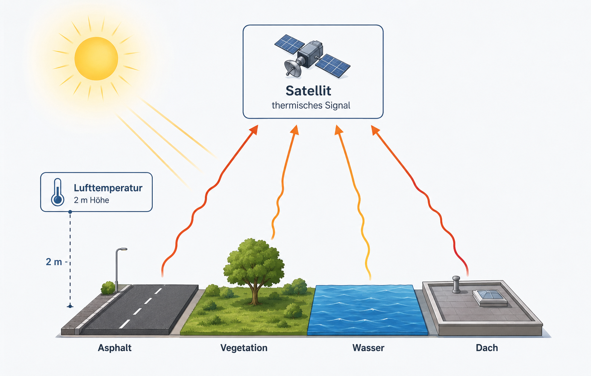

# Leitfrage

Warum werden manche Stadtflächen an heißen Sommertagen stärker aufgeheizt als andere?

Stadt besteht aus unterschiedlichen Oberflächen: Asphalt, Dächer, Beton, Wiese, Bäume, Wasser, helle und dunkle Materialien. Diese Oberflächen nehmen Sonnenstrahlung unterschiedlich auf, speichern Wärme unterschiedlich stark und geben Wärme unterschiedlich schnell wieder ab. Deshalb entstehen räumliche Temperaturmuster in der Stadt.

Die LST-Karte zeigt die **Oberflächentemperatur**. Sie zeigt nicht die Lufttemperatur. Eine rote Fläche bedeutet also: Die Oberfläche ist in dieser Satellitenszene warm oder heiß.

{fig-align="center" width="85%"}

# Arbeitsauftrag

Ihr arbeitet mit zwei Karten desselben Stadtgebiets:

1. **Luftbild:** Welche Oberflächen erkennt ihr?
2. **LST-Karte:** Welche Flächen erscheinen heiß, mittel oder kühl?

Ziel ist eine einfache Erklärung:

**Unterschiedliche Oberflächen erzeugen unterschiedliche Oberflächentemperaturen. Diese Unterschiede sind in der räumlichen Stadtstruktur sichtbar.**

# Vorgehen in 4 Schritten

## 1. Im Luftbild orientieren

Sucht zuerst bekannte oder auffällige Strukturen:

- Wasser
- Parks oder Baumflächen
- große Straßen
- große Dächer
- Parkplätze oder versiegelte Plätze
- dichte Bebauung

## 2. Oberflächen auf Folie markieren

Legt die Folie auf das Luftbild. Markiert mindestens **fünf größere Flächen**.

Nutzt einfache Kategorien:

| Zeichen | Oberfläche |
|---|---|
| G | Grünfläche / Bäume |
| W | Wasser |
| S | Straße / Parkplatz / versiegelt |
| D | Dach / Gebäude |
| M | Mischfläche |

## 3. Folie auf die LST-Karte legen

Vergleicht eure markierten Flächen mit der LST-Karte.

Tragt ein:

| Nr. | Oberfläche | LST-Tendenz | kurze Erklärung |
|---|---|---|---|
| 1 |  | heiß / mittel / kühl |  |
| 2 |  | heiß / mittel / kühl |  |
| 3 |  | heiß / mittel / kühl |  |
| 4 |  | heiß / mittel / kühl |  |
| 5 |  | heiß / mittel / kühl |  |

## 4. Regel formulieren

Formuliert eine vorsichtige Regel:

> In unserem Kartenausschnitt erscheinen __________________ eher heiß, während __________________ eher kühl erscheinen.  
> Eine plausible Erklärung ist: __________________.  
> Eine Ausnahme ist: __________________.

# Hilfe für die Erklärung

{fig-align="center" width="95%"}

Die Materialübersicht hilft euch beim ersten Vermuten. Sie ist keine Regel, die immer gilt. Prüft die Vermutungen an eurer Karte.

{fig-align="center" width="95%"}

Versiegelte Flächen wie Asphalt, große Dächer oder Parkplätze erscheinen oft wärmer, weil sie wenig Wasser verdunsten und Wärme gut speichern.

Grünflächen und Baumflächen erscheinen oft kühler, weil Pflanzen Wasser verdunsten und Schatten erzeugen.

Wasserflächen erscheinen häufig kühl, können aber je nach Tageszeit anders reagieren als Landflächen.

Dichte Stadtstrukturen können besonders warm erscheinen, wenn viele versiegelte Flächen dicht nebeneinander liegen.

# Merksatz

Die LST-Karte zeigt nicht einfach „wo es heiß ist“, sondern **welche Oberflächen sich stark oder schwach erwärmen**. Dadurch wird sichtbar, wie Stadtstruktur und Oberflächentemperatur zusammenhängen.