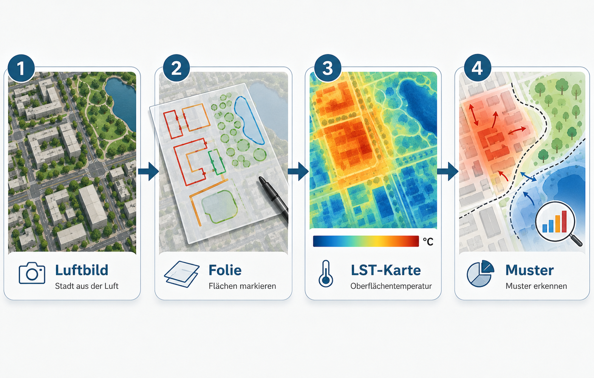
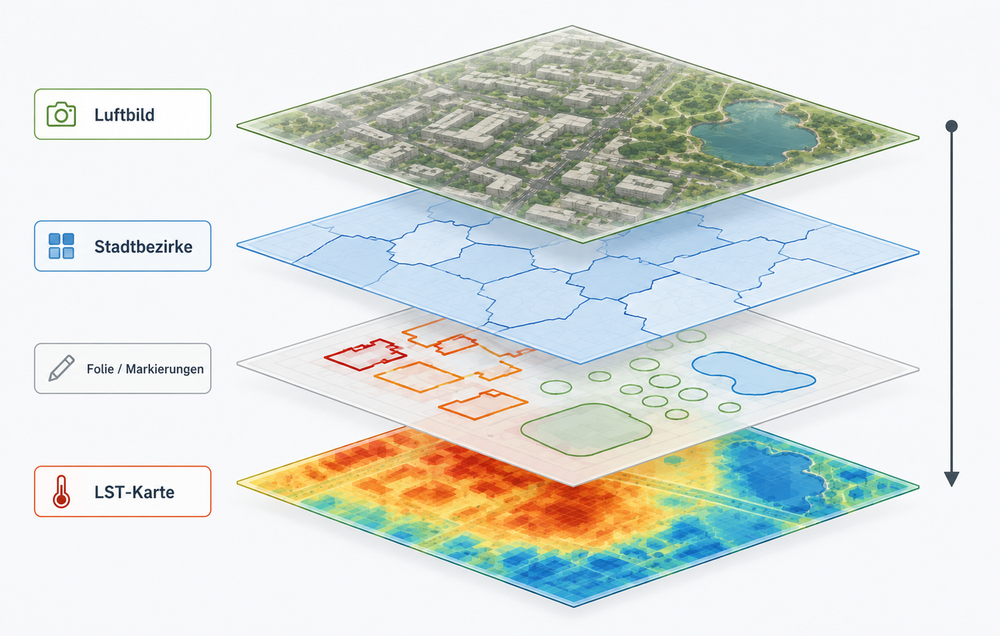

# Worum es in dieser Einheit geht

Diese Unterrichtseinheit untersucht, wie sich städtische Oberflächen in ihrer Temperatur unterscheiden. Die Lernenden arbeiten zuerst mit einem Luftbild. Sie markieren auf einer transparenten Folie Gebäude, Parks, Wasserflächen, große Straßen, Gewerbeflächen, offene Böden oder andere auffällige Oberflächen. Danach legen sie dieselbe Folie auf eine Karte der Land Surface Temperature, kurz LST. So wird sichtbar, welche markierten Oberflächen eher heiß oder eher kühl erscheinen.

Die fachliche Aufgabe ist bewusst einfach formuliert: **Welche Oberflächen sind wo heißer oder kühler, und welche räumlichen Muster entstehen daraus?** Die Lernenden sollen nicht zuerst GIS-Bedienung lernen. Sie sollen sehen, beschreiben, messen, vergleichen und begründen.

{fig-align="center" width="95%"}

Das Ergebnis ist keine perfekte Klimakarte. Das Ergebnis ist eine begründete räumliche Interpretation. Die Lernenden können benennen, welche Oberflächen mit hohen oder niedrigen LST-Werten zusammenfallen, welche Stadtbereiche als heiße oder kühle Muster auffallen und welche Prozesse dafür plausibel sind.

# Was LST bedeutet

**LST bedeutet Land Surface Temperature.** Gemeint ist die Temperatur der Erdoberfläche, wie sie ein Satellit im thermischen Infrarotbereich erfasst. Die Messung bezieht sich auf sichtbare oder thermisch wirksame Oberflächen: Dächer, Asphalt, Baumkronen, Wiesen, offene Böden, Wasserflächen oder versiegelte Plätze.

LST ist nicht dasselbe wie Lufttemperatur. Lufttemperatur wird typischerweise in etwa zwei Metern Höhe, belüftet und möglichst im Schatten gemessen. LST beschreibt dagegen die Temperatur der Oberfläche selbst. Deshalb kann eine Asphaltfläche sehr heiß erscheinen, während die Lufttemperatur daneben deutlich niedriger ist.

{fig-align="center" width="95%"}

Für den Unterricht ist diese Unterscheidung zentral. Stadtklima wird nicht als abstrakter Temperaturwert behandelt, sondern an konkrete Oberflächen gebunden: Versiegelung, Vegetation, Wasser, Schatten, Bebauungsdichte und Materialeigenschaften.

# Lernziele

Die Einheit verfolgt drei zusammenhängende Lernziele. Erstens sollen die Lernenden Oberflächen im Luftbild qualitativ erkennen und benennen. Zweitens sollen sie LST-Werte quantitativ aus Karte und Legende ablesen und einfachen Oberflächenklassen zuordnen. Drittens sollen sie räumlich-geographische Muster und Prozesse erklären.

Die qualitative Zuordnung beginnt ohne Temperaturkarte. Die Lernenden erkennen dichte Bebauung, große Dächer, Straßenräume, Parks, Baumgruppen, Wasserflächen oder offene Böden und halten diese Beobachtung auf Folie fest. Dadurch entstehen eigene Hypothesen.

Die quantitative Zuordnung erfolgt anschließend über die LST-Karte. Dabei geht es nicht um Scheingenauigkeit einzelner Pixel. Entscheidend ist die sinnvolle Zuordnung von Bereichen: eher heiß, mittel, eher kühl, auffällig abweichend.

Die räumliche Erklärung verbindet beides. Die Lernenden prüfen, ob große versiegelte Flächen Wärmeinseln bilden, ob Parks als kühlere Inseln erscheinen, ob der Rhein anders wirkt als angrenzende Uferflächen oder ob Stadtbezirke deutliche Unterschiede zeigen.

# Typische Oberflächen und Temperaturtendenzen

Die folgende Übersicht dient als Erwartungsrahmen. Sie ist keine feste Regelkarte. Die Lernenden sollen sie als Vermutung nutzen und anschließend mit der echten Karte prüfen.

| Oberfläche | typische Tendenz | mögliche Erklärung |
|---|---|---|
| Asphalt, breite Straßen, große Parkplätze | häufig warm bis heiß | dunkle Materialien, geringe Verdunstung, Wärmespeicherung |
| Dächer und Gewerbeflächen | häufig warm | Material, Exposition, wenig Vegetation |
| offener Boden | variabel | Feuchte und Bedeckung entscheiden stark |
| Parks und Wiesen | eher kühl bis mittel | Verdunstung, Bodenfeuchte, Vegetationsbedeckung |
| Baumflächen und Wald | häufig kühl | Schatten, Verdunstung, Kronenstruktur |
| Wasserflächen | tagsüber oft kühl | hohe Wärmeträgheit und Verdunstung |

{fig-align="center" width="95%"}

Wichtig ist die Formulierung „typisch“ oder „häufig“. Eine Wiese kann kühl sein, wenn sie feucht und vital ist, aber wärmer, wenn sie trocken ist. Ein Dach kann je nach Material, Farbe und Exposition sehr unterschiedliche Werte zeigen. Gerade diese Abweichungen sind didaktisch wertvoll, weil sie zur Begründung zwingen.

# Analoge Nutzung im Unterricht

Die analoge Variante ist die wichtigste Einstiegsform. Sie vermeidet, dass die Stunde zu einer GIS-Bedienschulung wird. Die Lernenden arbeiten mit Karten, Folie und Stiften.

{fig-align="center" width="95%"}

Benötigt werden ein Ausdruck des Luftbilds mit Stadtbezirksgrenzen, ein Ausdruck der LST-Karte mit demselben Ausschnitt und Maßstab, transparente Folie oder Transparentpapier, Folienstifte und eine einfache Legende zur LST-Karte.

Die Ausdrucke müssen exakt denselben Ausschnitt und Maßstab besitzen. Sonst passt die Folie nicht sauber auf beide Karten. In QGIS sollte deshalb ein festes Drucklayout genutzt werden. Dasselbe Layout wird einmal mit Luftbild und einmal mit LST-Karte ausgegeben.

{fig-align="center" width="95%"}

Zuerst orientieren sich die Lernenden auf dem Luftbild. Sie suchen Stadtbezirke, den Rhein, große Straßen, Parks oder bekannte Gebäude. Danach markieren sie Oberflächen auf der Folie. Die Temperaturkarte bleibt zunächst verdeckt.

Erst danach wird die Folie auf die LST-Karte gelegt. Die Lernenden vergleichen ihre Markierungen mit der Temperaturverteilung. Sie notieren, welche Oberflächen eher heiß oder eher kühl erscheinen, wo die Karte ihre Erwartung bestätigt und wo sie überrascht.

# Welche Ausdrucke sinnvoll sind

Für die Grundstunde sind drei Ausdrucke sinnvoll: eine Luftbildkarte mit Stadtbezirken, eine LST-Karte mit demselben Ausschnitt und eine Legende mit kurzer Erklärung. Für eine Erweiterung können eine OSM-Kontrollkarte und eine zweite LST-Karte aus dem anderen Extremmodus ergänzt werden.

| Ausdruck | Inhalt | Zweck |
|---|---|---|
| A | Luftbild + Stadtbezirke + Stadtgrenze | Arbeitskarte für Markierungen auf Folie |
| B | LST-Karte + Stadtbezirke + Stadtgrenze | Vergleichskarte zur Überlagerung |
| C | Legende und kurze Erklärung | Hilfe zur Interpretation der Temperaturfarben |

# Typische Fehlinterpretationen

Die häufigste Fehlinterpretation lautet: „Dort ist die Luft heißer.“ Präziser ist: „Dort ist die Oberfläche in der Satellitenszene wärmer.“ Diese Unterscheidung sollte wiederholt werden.

Eine zweite Fehlinterpretation betrifft einzelne Pixel. Landsat-LST eignet sich nicht für einzelne kleine Objekte wie einen einzelnen Baum oder einen schmalen Gehweg. Die Karte ist stark genug für größere Muster: Parks, Gewerbeflächen, Flussräume, Stadtbezirke, große Verkehrsachsen oder größere Bebauungsstrukturen.

Eine dritte Fehlinterpretation betrifft Kausalität. Eine warme Fläche ist nicht automatisch warm, weil sie versiegelt ist. Versiegelung ist ein plausibler Faktor, aber Material, Farbe, Feuchte, Schatten, Exposition und Tageszeit müssen mitgedacht werden.

# Ergebnis der Stunde

Am Ende entsteht eine interpretierte Karte oder ein kurzer Ergebnisbogen. Darin benennen die Lernenden mindestens drei Oberflächenklassen, ordnen ihnen Temperaturtendenzen zu und erklären ein räumliches Muster mit mindestens einem Prozess, zum Beispiel Verdunstung, Verschattung, Versiegelung oder Wärmespeicherung.
