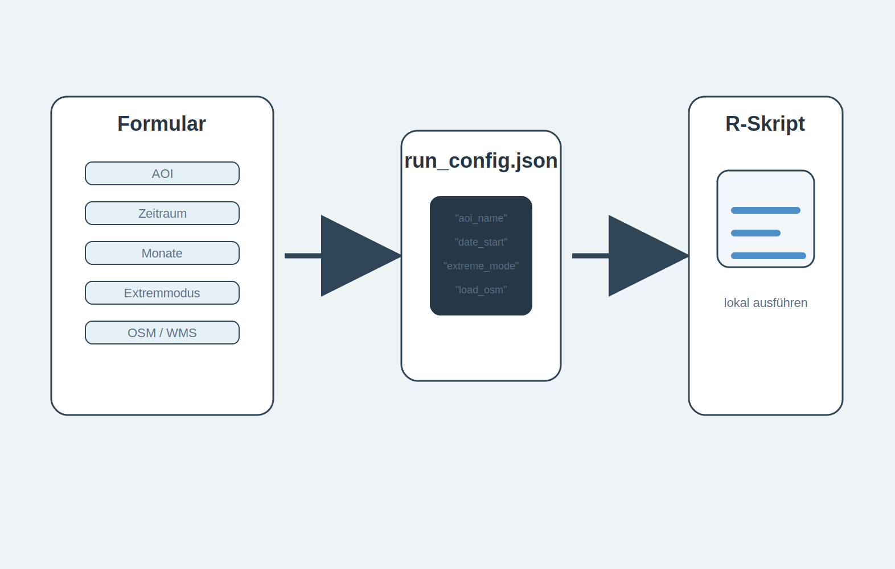

# Zweck dieser technischen Handreichung

Diese Seite beschreibt, wie das lokale Datenpaket erzeugt wird. Sie richtet sich an Lehrkräfte, Projektbetreuung oder fortgeschrittene Gruppen, die die Daten selbst vorbereiten oder den QGIS-Ausdruck anpassen wollen.

Die technische Arbeit soll nicht den Unterricht dominieren. Sie stellt die Materialien bereit: LST-Karten, Luftbild-/Orientierungsebenen, Verwaltungsgrenzen, OSM-Strukturlayer und ein vorbereitetes QGIS-Projekt.

  {fig-align="center" width="95%"}

# Grundprinzip des Datenpakets

Das Skript arbeitet AOI-basiert. Für jedes Untersuchungsgebiet wird ein eigener lokaler Ordner angelegt. Der Ordnername wird aus `aoi_name` gebildet. Dadurch bleiben Daten für verschiedene Städte oder Stadtteile getrennt.

Das Skript sucht Landsat 8/9 Collection 2 Level-2 Szenen, berechnet aus dem thermischen Band die Oberflächentemperatur in Grad Celsius, maskiert Wolken und Wolkenschatten, schneidet die Karten auf das AOI zu und speichert alle Zwischenergebnisse lokal. Danach werden heiße und/oder kalte Extremsituationen ausgewählt und als Unterrichtsmaterial weiterverarbeitet.

{fig-align="center" width="95%"}

# Konfiguration statt Codeänderung

Für Lehrkräfte ist es sinnvoller, eine Konfigurationsdatei zu erzeugen, statt im Skript einzelne Zeilen zu verändern. Die statische Quarto-Seite `konfigurator_lst_paket.qmd` erzeugt eine `run_config.json` und einen passenden R-Konfigurationsblock.

{fig-align="center" width="95%"}

Eine typische Konfiguration sieht so aus:

```json
{
  "aoi_name": "koeln",
  "aoi_mode": "koeln_stadtbezirke",
  "project_root": "data/landsat_lst",
  "date_start": "2020-01-01",
  "date_end": "2026-06-05",
  "seasonal_months": [4, 5, 6, 7, 8, 9],
  "extreme_mode": "both",
  "n_hot": 10,
  "n_cold": 10,
  "load_osm_layers": true,
  "add_aerial_wms": true
}
```

Das vorhandene Skript kann weiter mit einem festen Konfigurationsblock verwendet werden. Für eine spätere Kapselung ist die JSON-Variante sinnvoller: Das Skript liest dann zu Beginn `run_config.json` und überschreibt daraus die Standardwerte.

# Lokale Ordnerstruktur

Die lokale Struktur folgt diesem Prinzip:

```text
data/landsat_lst/<aoi_name>/
├── 00_config/
├── 01_aoi/
├── 02_stac/
├── 03_landsat_scenes/
├── 04_extremes/
│   ├── hot/
│   └── cold/
├── 05_teaching_layers/
├── 06_qgis_project/
├── 99_logs/
└── manifest.json
```

`manifest.json` dient als technischer Wegweiser. Dort werden die wichtigsten erzeugten Dateien dokumentiert: AOI-Paket, STAC-Metadaten, verarbeitete Szenen, Extremprodukte, Teaching-Layer und QGIS-Projekt.

{fig-align="center" width="95%"}

# Technische Stabilitätsentscheidungen

Die Planetary-Computer-URLs werden nicht dauerhaft signiert gespeichert. Signierte Azure-URLs laufen ab. Deshalb wird jede Landsat-Szene erst unmittelbar vor dem Lesen signiert. Bereits verarbeitete lokale LST-Dateien werden wiederverwendet, damit das Skript nicht unnötig erneut auf entfernte Daten zugreift.

Der OSM-Teil kann wegen Overpass-Limits scheitern. Bei `HTTP 429 Too Many Requests` sollte entweder später erneut gestartet werden, ein alternativer Overpass-Endpoint genutzt werden oder `load_osm_layers <- FALSE` gesetzt werden. Die LST-Verarbeitung ist von OSM fachlich unabhängig.

# LST-Verarbeitung

Die LST wird aus dem Landsat-Produkt in Grad Celsius umgerechnet. Danach wird die Karte auf das AOI zugeschnitten. Über das QA-Band werden Wolken, Wolkenschatten, Cirrus, Schnee und ungültige Pixel entfernt.

Für jede Szene werden Kennwerte berechnet: Mittelwert, Median, 10%-Perzentil, 90%-Perzentil, Minimum, Maximum und gültiger Pixelanteil. Für heiße Szenen ist das 90%-Perzentil eine robuste Standardmetrik, weil es hohe Temperaturen erfasst, ohne von einzelnen Ausreißerpixeln abhängig zu sein. Für kalte Szenen ist ein niedriges Perzentil geeigneter als ein einzelnes Minimum.

# QGIS-Projekt und Ausdrucke

Das Skript schreibt ein PyQGIS-Skript. Dieses erzeugt ein QGIS-Projekt mit Luftbild-WMS, LST-Rastern, AOI-/Verwaltungsgrenzen und OSM-Strukturlayern. Das Projekt dient vor allem zum Drucken identischer Kartenausschnitte.

Für den Unterricht werden mindestens zwei Layoutvarianten gebraucht: eine Luftbildkarte zur Folienmarkierung und eine LST-Karte zur Überlagerung. Beide Layouts müssen exakt denselben Ausschnitt und Maßstab nutzen.

# Empfohlener technischer Ablauf

Zuerst wird im Konfigurator die AOI-Konfiguration erzeugt. Danach wird das R-Skript lokal ausgeführt. Die erzeugten Karten werden in QGIS geöffnet und mit einem festen Layout exportiert. Für den Unterricht werden die Ausdrucke vorbereitet, nicht das ganze Skript erklärt.

Wenn nur die LST-Produkte benötigt werden, kann `load_osm_layers` ausgeschaltet werden. OSM ist eine hilfreiche Orientierungsebene, aber keine Voraussetzung für die eigentliche Oberflächentemperaturkarte.
